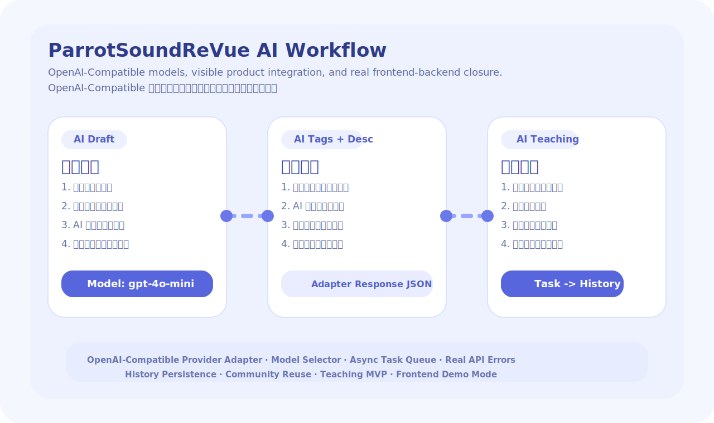

<div align="center">
  

  <h1>ParrotSoundReVue</h1>

  <p>
    <strong>EN:</strong> An open-source AI voice app for dubbing, voice cloning, and teaching content creation.
    <br />
    <strong>中文:</strong> 一个开源的 AI 语音应用，聚焦智能配音、声音克隆与教学内容生成。
  </p>

  <p>
    <a href="https://opensource.org/licenses/MIT"></a>
    
    
    
    
  </p>

  <p>
    <a href="#overview--项目简介">Overview</a> |
    <a href="#github-about--github-仓库简介">GitHub About</a> |
    <a href="#key-features--核心功能">Features</a> |
    <a href="#ai-workflow--ai-工作流">AI Workflow</a> |
    <a href="#quick-start--快速开始">Quick Start</a> |
    <a href="#project-structure--项目结构">Structure</a> |
    <a href="#performance--concurrency--性能与并发">Performance</a> |
    <a href="#license--开源协议">License</a>
  </p>
</div>

---



## Overview / 项目简介

**EN:** ParrotSoundReVue is a full-stack AI product prototype focused on real large-model integration instead of isolated demo buttons. It connects AI draft generation, dubbing, voice cloning, teaching project creation, user history, notifications, and community voice reuse into one end-to-end workflow.

**中文：** ParrotSoundReVue 是一个全栈 AI 产品原型，重点不是孤立的模型演示按钮，而是把大模型真正接入到业务流程中。项目把 AI 文稿生成、智能配音、声音克隆、教学项目生成、历史记录、通知中心和社区声音复用串成了完整闭环。

**Tech Stack / 技术栈**

- `parrot-frontend`: `Vue 3 + Vite + TypeScript + Element Plus`
- `parrot-backend`: `Express + Redis adapter + MySQL adapter + JWT`
- AI integration / AI 接入：OpenAI-compatible model adapter with configurable provider and model list / 基于 OpenAI-Compatible 协议的模型适配层，可配置 provider、base URL 和模型列表

## GitHub About / GitHub 仓库简介

Use the following metadata for the GitHub repository `About` panel.
<br />
可以将下面这组内容直接填写到 GitHub 仓库右侧的 `About` 区域。

### Description / 描述

`An open-source AI voice app for dubbing, voice cloning, and teaching content creation.`

`一个开源的 AI 语音应用，聚焦智能配音、声音克隆与教学内容生成。`

### Website / 网站

`https://github.com/Wanfeng1028/ParrotSoundReVue#readme`

### Topics / 标签

`ai`, `voice-cloning`, `dubbing`, `text-to-speech`, `tts`, `speech`, `audio`, `education`, `vue3`, `vite`, `express`, `openai-compatible`

## Key Features / 核心功能

### 1. AI Dubbing / 智能配音

- **EN:** Select models directly in the dubbing UI.
  <br />
  **中文：** 在智能配音页面直接选择模型。
- **EN:** Generate dubbing scripts from prompts with async task polling.
  <br />
  **中文：** 根据提示词生成配音文稿，并通过异步任务轮询获取结果。
- **EN:** Preview and export audio through task-based APIs.
  <br />
  **中文：** 试听和导出音频都走任务化接口，避免阻塞请求。
- **EN:** Automatically write completed outputs into audio history.
  <br />
  **中文：** 已完成的配音结果会自动进入音频记录与历史中心。

### 2. Voice Cloning / 声音克隆

- **EN:** Upload or record voice samples.
  <br />
  **中文：** 支持上传或录制声音样本。
- **EN:** Generate model description and tags with AI assistance.
  <br />
  **中文：** 支持 AI 自动生成模型描述与标签建议。
- **EN:** Create private or public voice models.
  <br />
  **中文：** 支持创建私有或公开声音模型。
- **EN:** Reuse created voices in dubbing, teaching, and community flows.
  <br />
  **中文：** 创建后的声音可回流到配音、教学和社区场景中复用。

### 3. Teaching Workflow / 教育教学工作流

- **EN:** Create teaching projects with slides, scripts, speakers, voices, and backgrounds.
  <br />
  **中文：** 可创建包含页面、讲稿、数字人、声音和背景配置的教学项目。
- **EN:** Generate teaching narration with AI.
  <br />
  **中文：** 支持通过 AI 生成教学讲解稿。
- **EN:** Submit generation tasks asynchronously.
  <br />
  **中文：** 支持异步提交教学生成任务。
- **EN:** Sync finished teaching jobs into user history.
  <br />
  **中文：** 完成后的教学任务会同步进入用户历史记录。

### 4. Community Voice Library / 社区声音库

- **EN:** Search, filter, preview, like, favorite, and reuse public voices.
  <br />
  **中文：** 支持搜索、筛选、试听、点赞、收藏和复用公开声音。
- **EN:** Send selected community voices back into the dubbing workflow.
  <br />
  **中文：** 选中的社区音色可以直接带回智能配音页面继续创作。
- **EN:** Maintain ranking boards with cached hot data.
  <br />
  **中文：** 排行榜和热点列表支持缓存优化。

### 5. User System / 用户系统

- **EN:** Register, login, reset password, and restore JWT sessions.
  <br />
  **中文：** 支持注册、登录、重置密码与 JWT 登录态恢复。
- **EN:** Update profile and avatar.
  <br />
  **中文：** 支持资料编辑与头像上传。
- **EN:** View paginated history, interactions, and notifications.
  <br />
  **中文：** 支持分页查看历史作品、互动消息和通知中心。
- **EN:** Includes a frontend-only demo account for UI acceptance.
  <br />
  **中文：** 内置仅前端校验的测试账号，便于 UI 验收。

## AI Workflow / AI 工作流

**EN:** The AI capability in this project is visible in the product, not hidden behind backend placeholders.
<br />
**中文：** 本项目的 AI 能力是显性出现在产品中的，而不是藏在后端的占位逻辑里。

### Implemented AI Entry Points / 已落地的 AI 入口

- **EN:** Dubbing page: prompt -> model selection -> script generation -> preview/export task
  <br />
  **中文：** 智能配音页：提示词 -> 模型选择 -> 文稿生成 -> 试听/导出任务
- **EN:** Voice clone page: prompt -> AI description/tag suggestion -> model creation
  <br />
  **中文：** 声音克隆页：提示词 -> AI 描述/标签建议 -> 创建模型
- **EN:** Teaching page: prompt -> model selection -> teaching script generation -> generation task
  <br />
  **中文：** 教学页：提示词 -> 模型选择 -> 讲解稿生成 -> 生成任务

### Model Adapter Design / 模型适配层设计

- **EN:** Backend adapter file: `parrot-backend/src/services/ai-service.js`
  <br />
  **中文：** 后端适配器文件：`parrot-backend/src/services/ai-service.js`
- **EN:** Protocol: OpenAI-compatible `chat/completions`
  <br />
  **中文：** 协议：兼容 OpenAI `chat/completions`
- **EN:** Runtime config: `AI_PROVIDER`, `AI_BASE_URL`, `AI_API_KEY`, `AI_DEFAULT_MODEL`, `AI_MODELS`
  <br />
  **中文：** 运行时配置：`AI_PROVIDER`、`AI_BASE_URL`、`AI_API_KEY`、`AI_DEFAULT_MODEL`、`AI_MODELS`

### Failure Handling / 失败态处理

- **EN:** If no API key is configured, the backend returns explicit configuration errors.
  <br />
  **中文：** 如果未配置 API Key，后端会明确返回配置错误。
- **EN:** AI-heavy flows are task-based, so the web process is not blocked by long requests.
  <br />
  **中文：** AI 重操作已经任务化，避免长请求阻塞 Web 进程。
- **EN:** Frontend polls task status through `/api/tasks/:taskId`.
  <br />
  **中文：** 前端通过 `/api/tasks/:taskId` 轮询任务状态。

## Quick Start / 快速开始

### 1. Install Dependencies / 安装依赖

```bash
cd parrot-backend
npm install

cd ../parrot-frontend
npm install
```

### 2. Configure Environment Variables / 配置环境变量

Backend / 后端：

```bash
cd parrot-backend
cp .env.example .env
```

Frontend / 前端：

```bash
cd parrot-frontend
cp .env.example .env
```

### 3. Start Backend / 启动后端

```bash
cd parrot-backend
npm start
```

### 4. Start Frontend / 启动前端

```bash
cd parrot-frontend
npm run dev
```

**Default local addresses / 默认本地地址**

- Frontend / 前端：`http://localhost:5173`
- Backend / 后端：`http://localhost:3000`

## Frontend Demo Account / 前端演示账号

**EN:** For pure frontend acceptance without backend dependency:
<br />
**中文：** 如果只做前端验收、不依赖后端账号，可以使用下面的演示账号：

- Email / 邮箱：`demo@frontend.local`
- Password / 密码：`Demo123456`

**EN:** This account uses browser-side mock data but follows the same paginated and task-based API structure as the real frontend.
<br />
**中文：** 这个账号使用浏览器本地 mock 数据，但仍然遵循与真实前端一致的分页和任务化接口结构。

## Project Structure / 项目结构

```text
ParrotSoundReVue/
|-- docs/
|   `-- demo/
|       `-- ai-workflow.svg
|-- parrot-backend/
|   |-- src/
|   |   |-- config/
|   |   |-- middleware/
|   |   |-- routes/
|   |   |-- services/
|   |   `-- utils/
|   `-- .env.example
|-- parrot-frontend/
|   |-- src/
|   |   |-- api/
|   |   |-- assets/
|   |   |-- composables/
|   |   |-- mocks/
|   |   |-- router/
|   |   |-- stores/
|   |   |-- types/
|   |   `-- views/
|   `-- .env.example
|-- LICENSE
`-- README.md
```

## Performance & Concurrency / 性能与并发

**EN:** This project now includes a first round of real optimization work.
<br />
**中文：** 当前版本已经完成第一轮真实的性能与并发优化。

### Frontend Optimization / 前端优化

- Route-level lazy loading / 路由级懒加载
- Element Plus auto-import and component-level loading / Element Plus 自动按需引入
- Vite manual chunk splitting / Vite 手动拆包
- `webp`-based large image optimization / 大图 `webp` 优化
- Debounced search for list-heavy pages / 列表页搜索防抖
- Paginated rendering for community, history, notification, interaction, record, and teaching pages / 社区、历史、通知、互动、记录和教学页改为分页渲染

### Backend Optimization / 后端优化

- Gzip compression middleware / Gzip 压缩中间件
- Request logging with timing and cache-hit markers / 带耗时和缓存命中的请求日志
- Cache abstraction with Redis fallback to in-memory TTL cache / Redis 优先、内存 TTL 降级的缓存抽象
- Paginated list APIs / 列表接口分页化
- Static file cache headers for `/uploads` / `/uploads` 静态资源缓存头
- In-memory state cache and delayed flush for file-store fallback / 文件存储降级模式下的内存状态缓存与延迟落盘

### High-Concurrency Design / 高并发设计

- Stateless JWT-based auth path / 无状态 JWT 鉴权
- Async task queue for AI generation and export-heavy flows / AI 生成与导出重操作的异步任务队列
- `/api/tasks/:taskId` polling interface / `/api/tasks/:taskId` 任务轮询接口
- Rate limiting for auth, AI, export, feedback, and interaction endpoints / 登录、AI、导出、反馈、互动接口限流
- MySQL pool configuration prepared for higher concurrency deployment / 面向更高并发部署的 MySQL 连接池配置
- Redis-ready cache and counter design for multi-instance deployment / 面向多实例部署的 Redis 缓存与计数器设计

## Public API Conventions / 公共接口约定

### Paginated Responses / 分页响应

```json
{
  "items": [],
  "total": 0,
  "page": 1,
  "pageSize": 12
}
```

### Task Responses / 任务响应

```json
{
  "taskId": "xxx",
  "status": "queued"
}
```

### Task Status Polling / 任务状态轮询

```json
{
  "taskId": "xxx",
  "status": "completed",
  "progress": 100,
  "result": {}
}
```

## Environment Variables / 环境变量

### Frontend / 前端

| Variable | Description | 中文说明 |
| --- | --- | --- |
| `VITE_API_BASE_URL` | Backend API base URL | 后端 API 基础地址 |

### Backend / 后端

| Variable | Description | 中文说明 |
| --- | --- | --- |
| `PORT` | Backend port | 后端端口 |
| `FRONTEND_ORIGIN` | Frontend origin for CORS | 前端地址，用于 CORS |
| `JWT_SECRET` | JWT secret | JWT 密钥 |
| `DATA_DIR` | Local data directory | 本地数据目录 |
| `UPLOAD_DIR` | Upload directory | 上传目录 |
| `REQUEST_LOG_SLOW_MS` | Slow-request threshold | 慢请求阈值 |
| `CACHE_TTL_SECONDS` | Default cache TTL | 默认缓存时间 |
| `QUEUE_CONCURRENCY` | Async task concurrency | 异步任务并发数 |
| `SMTP_*` | Verification code email service | 验证码邮件服务 |
| `REDIS_URL` | Redis connection string | Redis 连接地址 |
| `MYSQL_*` | MySQL connection config | MySQL 连接配置 |
| `AI_PROVIDER` | AI provider name | AI 提供方名称 |
| `AI_BASE_URL` | OpenAI-compatible API base URL | OpenAI-Compatible API 地址 |
| `AI_API_KEY` | AI API key | AI 接口密钥 |
| `AI_DEFAULT_MODEL` | Default AI model | 默认模型 |
| `AI_MODELS` | Comma-separated available models | 可选模型列表 |

## Validation / 验证情况

**EN:** Completed local validation for the current version:
<br />
**中文：** 当前版本已完成以下本地验证：

- Frontend production build: `npm run build`
- Backend app load smoke test: `node -e "require('./src/app')"`

## License / 开源协议

This project is released under the [MIT License](./LICENSE).
<br />
本项目基于 [MIT License](./LICENSE) 开源。

## Credits / 说明

**EN:** This repository is organized around visible AI product integration, full frontend-backend feature closure, deployable model extension, and practical performance/concurrency improvements.
<br />
**中文：** 本仓库围绕“AI 能力显性落地、前后端功能闭环、可部署的模型扩展、可执行的性能与并发优化”进行设计和实现。
