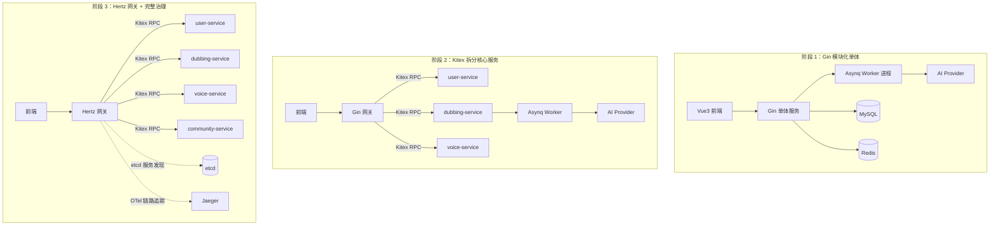
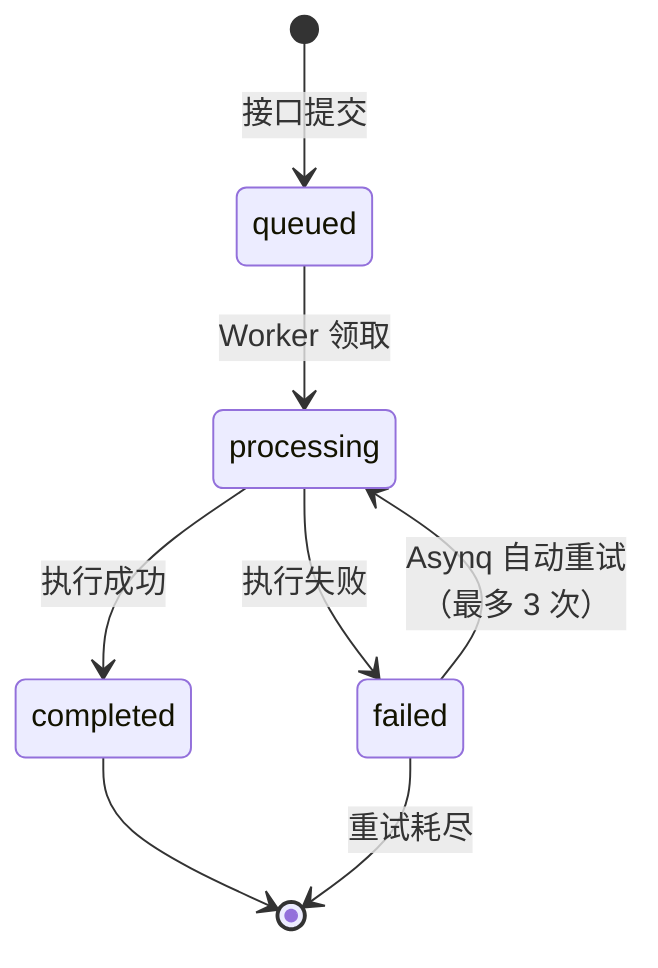
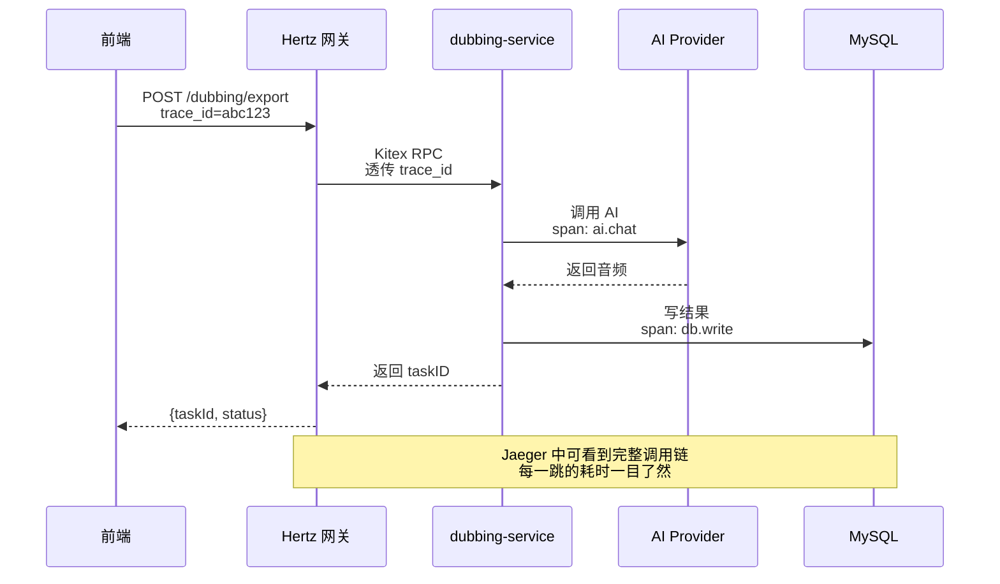
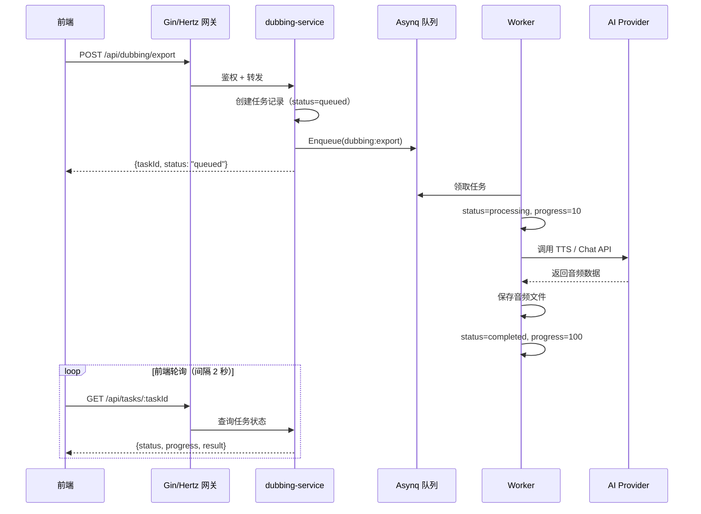
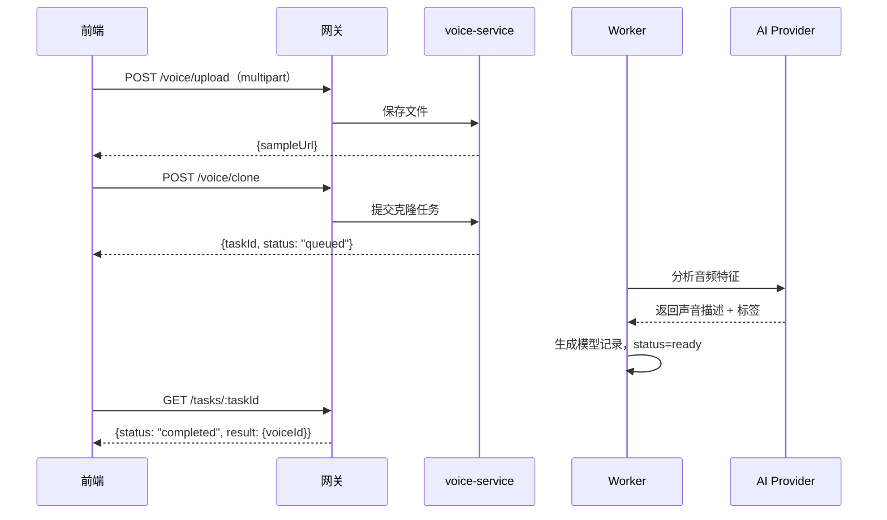

### 先回答你的问题：这算混用框架吗？

**不算"混用"，这叫分层组合。** 真正的混用是指同一个层次同时用两个同类框架（比如同一个 HTTP 服务里既用 Gin 又用 Echo，那才叫乱）。而 Gin + Kitex + Hertz 是**不同层次的职责分工**：Gin/Hertz 管"对外 HTTP"，Kitex 管"服务间 RPC"，Asynq 管"异步任务"。这种组合在业界非常常见，就像一辆车有发动机、变速箱、刹车系统，它们来自不同供应商，但各司其职，不冲突。

**真实项目里非常普遍。** 字节内部就是 Hertz + Kitex 配套；很多公司用 Gin 做网关 + gRPC 做内部通信；还有 Go 服务调 Java 服务、Go 服务调 Python 推理服务的场景。架构师从来不会要求"一个项目只能用一个框架"，只会要求"每一层的选型有合理理由"。所以放心，这个方案在简历上是加分项，不是减分项。

下面是完整的技术文档。

---

# ParrotSound（鹦音坊）Go 后端技术设计文档

**版本：v1.0 ｜ 目标：从 Gin 模块化单体到 CloudWeGo 微服务的完整演进路线**

## **一、项目定位与设计目标**

ParrotSound 是一个全栈 AI 语音平台，核心能力包括智能配音、声音克隆、教育教学课件生成、社区声音分享、用户体系和管理后台。当前 Node.js 版本采用 Express + Redis + MySQL 的单体架构，本文档规划 Go 版本的完整实现方案，并以学习微服务为目标，设计了清晰的三阶段演进路线。

设计上遵循四个原则。**第一，接口零改动**：所有 HTTP API 的路径、请求参数、响应格式与 Node 版完全一致，前端一行代码不用改即可切换。**第二，模块化单体**：代码按业务域组织，每个域内部分层清晰，天然支持未来按域拆分。**第三，异步优先**：所有 AI 调用、音频导出、课件生成一律走异步任务队列，HTTP 接口只负责任务提交和状态查询。**第四，渐进式微服务**：不为拆而拆，按业务痛点逐步拆分，每一步都有明确的技术收益。

## **二、技术选型总览**

| 层次                | 选型                   | 版本建议 | 作用                    |
| ------------------- | ---------------------- | -------- | ----------------------- |
| HTTP 框架（阶段 1） | Gin                    | v1.10+   | 对外 API 网关           |
| HTTP 框架（阶段 3） | Hertz                  | 最新版   | 替换 Gin 作为高性能网关 |
| RPC 框架（阶段 2）  | Kitex                  | 最新版   | 服务间内部通信          |
| ORM                 | GORM                   | v2       | MySQL 数据访问          |
| 缓存                | go-redis/v9            | v9       | 缓存与计数器            |
| 异步任务            | Asynq                  | v0.24+   | Redis-backed 任务队列   |
| 认证                | golang-jwt/v5          | v5       | 无状态 JWT              |
| 限流                | golang.org/x/time/rate | -        | 令牌桶算法              |
| 配置                | Viper                  | v1.18+   | 环境变量与配置文件      |
| 日志                | Zap                    | v1.27+   | 结构化日志              |
| 链路追踪（阶段 2）  | OpenTelemetry + Jaeger | -        | 分布式追踪              |
| 服务发现（阶段 2）  | etcd                   | v3.5+    | 服务注册与发现          |
| ID 生成             | Sonyflake 或 UUID      | -        | 任务 ID                 |

选型理由可以浓缩成一句话：**每一层选最主流、资料最多、社区最活跃的方案**，降低学习成本，同时保留向字节生态（Hertz + Kitex）平滑演进的能力。

## **三、架构演进总览**



**阶段 1** 的目标是把所有功能跑通，重点是分层设计和异步任务链路。**阶段 2** 把最重的配音任务和声音克隆拆成独立 Kitex 服务，这是学习微服务核心概念的阶段。**阶段 3** 把网关换成 Hertz，补齐服务发现、链路追踪、熔断等治理能力，形成完整的微服务体系。

## **四、阶段 1：Gin 模块化单体（核心阶段）**

### **4.1 目录结构**

目录按业务域组织，每个域是一个自包含的包，内部严格遵循 handler → service → repository 三层结构。这样设计的直接好处是：未来拆分时，整个域目录可以原封不动地搬进独立服务。

```
parrot-backend-go/
├── cmd/
│   ├── server/main.go              # HTTP 服务入口
│   └── worker/main.go              # Asynq Worker 入口
├── internal/
│   ├── config/config.go            # 配置加载
│   ├── middleware/
│   │   ├── jwt.go                  # JWT 鉴权
│   │   ├── admin_jwt.go            # 管理员鉴权
│   │   ├── ratelimit.go            # 限流
│   │   ├── logger.go               # 请求日志
│   │   └── cors.go
│   ├── auth/                       # 认证域
│   │   ├── handler.go
│   │   ├── service.go
│   │   └── repository.go
│   ├── user/                       # 用户域
│   ├── dubbing/                    # 配音域
│   ├── voice/                      # 声音克隆域
│   ├── teaching/                   # 教学域
│   ├── community/                  # 社区域
│   ├── help/                       # 帮助中心域
│   ├── admin/                      # 管理后台域
│   ├── task/                       # 异步任务
│   │   ├── queue.go                # Asynq 客户端封装
│   │   ├── types.go                # 任务类型定义
│   │   └── handlers.go             # 任务处理器
│   ├── ai/
│   │   ├── client.go               # OpenAI 协议客户端
│   │   └── prompts.go              # Prompt 模板
│   ├── cache/
│   │   ├── cache.go                # 缓存接口
│   │   ├── redis_impl.go
│   │   └── memory_impl.go          # 内存降级实现
│   ├── storage/
│   │   ├── storage.go              # 存储接口
│   │   └── local_impl.go           # 本地文件存储
│   ├── model/                      # GORM 数据模型
│   └── router/router.go            # 路由注册
├── pkg/
│   ├── response/response.go        # 统一响应格式
│   └── pagination/pagination.go    # 分页工具
├── migrations/001_init.sql
├── .env.example
├── go.mod
├── Dockerfile
├── docker-compose.yml
└── Makefile
```

### **4.2 统一响应格式**

保持与 Node 版完全一致的响应结构，这是前端零改动的前提。

```go
// pkg/response/response.go
package response

import "github.com/gin-gonic/gin"

// 分页响应：与 Node 版 {items, total, page, pageSize} 一致
type Paginated struct {
    Items    interface{} `json:"items"`
    Total    int64       `json:"total"`
    Page     int         `json:"page"`
    PageSize int         `json:"pageSize"`
}

func OK(c *gin.Context, data interface{}) {
    c.JSON(200, data)
}

func Paginated(c *gin.Context, items interface{}, total int64, page, pageSize int) {
    c.JSON(200, Paginated{Items: items, Total: total, Page: page, PageSize: pageSize})
}

// 任务创建响应：{taskId, status: "queued"}
func TaskCreated(c *gin.Context, taskID string) {
    c.JSON(200, gin.H{"taskId": taskID, "status": "queued"})
}

// 错误响应：429 限流时返回此格式
func Error(c *gin.Context, code int, msg string) {
    c.JSON(code, gin.H{"code": -1, "message": msg})
}
```

### **4.3 数据模型定义**

所有模型与 MySQL 表结构一一对应，GORM tag 负责映射。

```go
// internal/model/user.go
type User struct {
    ID        uint      `gorm:"primaryKey" json:"id"`
    Email     string    `gorm:"uniqueIndex;size:255" json:"email"`
    Password  string    `json:"-"` // 永不序列化到响应
    Nickname  string    `gorm:"size:100" json:"nickname"`
    Avatar    string    `gorm:"size:500" json:"avatar"`
    Role      string    `gorm:"size:20;default:user" json:"role"`
    Status    string    `gorm:"size:20;default:active" json:"status"`
    CreatedAt time.Time `json:"createdAt"`
    UpdatedAt time.Time `json:"updatedAt"`
}

// internal/model/voice.go
type VoiceModel struct {
    ID          uint      `gorm:"primaryKey" json:"id"`
    UserID      uint      `gorm:"index" json:"userId"`
    Name        string    `gorm:"size:200" json:"name"`
    Description string    `gorm:"type:text" json:"description"`
    Tags        string    `gorm:"type:json" json:"tags"`
    SampleURL   string    `gorm:"size:500" json:"sampleUrl"`
    Status      string    `gorm:"size:20;default:training" json:"status"`
    CreatedAt   time.Time `json:"createdAt"`
}

// internal/model/dubbing_job.go
type DubbingJob struct {
    ID        uint      `gorm:"primaryKey" json:"id"`
    UserID    uint      `gorm:"index" json:"userId"`
    Title     string    `gorm:"size:500" json:"title"`
    Script    string    `gorm:"type:text" json:"script"`
    Model     string    `gorm:"size:100" json:"model"`
    VoiceID   uint      `json:"voiceId"`
    Status    string    `gorm:"size:20;default:pending" json:"status"`
    AudioURL  string    `gorm:"size:500" json:"audioUrl"`
    CreatedAt time.Time `json:"createdAt"`
}

// internal/model/task.go —— 任务状态机的核心
type Task struct {
    ID        string    `gorm:"primaryKey;size:36" json:"taskId"`
    Type      string    `gorm:"size:50" json:"type"`
    Status    string    `gorm:"size:20;default:queued" json:"status"`
    Progress  int       `gorm:"default:0" json:"progress"`
    Payload   string    `gorm:"type:json" json:"-"`
    Result    string    `gorm:"type:json" json:"result"`
    Error     string    `gorm:"size:1000" json:"error,omitempty"`
    UserID    uint      `gorm:"index" json:"userId"`
    RetryCount int      `gorm:"default:0" json:"-"`
    CreatedAt time.Time `json:"createdAt"`
    UpdatedAt time.Time `json:"updatedAt"`
}
```

### **4.4 JWT 认证中间件**

```go
// internal/middleware/jwt.go
package middleware

type Claims struct {
    UserID uint   `json:"userId"`
    Email  string `json:"email"`
    Role   string `json:"role"`
    jwt.RegisteredClaims
}

func JWTAuth(secret string) gin.HandlerFunc {
    return func(c *gin.Context) {
        header := c.GetHeader("Authorization")
        token := strings.TrimPrefix(header, "Bearer ")
        if token == "" || token == header {
            response.Error(c, 401, "未登录")
            c.Abort()
            return
        }
        claims := &Claims{}
        _, err := jwt.ParseWithClaims(token, claims, func(t *jwt.Token) (interface{}, error) {
            return []byte(secret), nil
        })
        if err != nil {
            response.Error(c, 401, "token 无效或已过期")
            c.Abort()
            return
        }
        c.Set("userID", claims.UserID)
        c.Set("email", claims.Email)
        c.Set("role", claims.Role)
        c.Next()
    }
}
```

### **4.5 限流中间件（令牌桶）**

```go
// internal/middleware/ratelimit.go
type RateLimiter struct {
    mu       sync.Mutex
    limiters map[string]*rate.Limiter
    rate     rate.Limit
    burst    int
}

func NewRateLimiter(r rate.Limit, burst int) *RateLimiter {
    return &RateLimiter{
        limiters: make(map[string]*rate.Limiter),
        rate:     r,
        burst:    burst,
    }
}

func (rl *RateLimiter) getLimiter(key string) *rate.Limiter {
    rl.mu.Lock()
    defer rl.mu.Unlock()
    if limiter, ok := rl.limiters[key]; ok {
        return limiter
    }
    limiter := rate.NewLimiter(rl.rate, rl.burst)
    rl.limiters[key] = limiter
    return limiter
}

// 限流键：登录用户用 userID，未登录用 IP
func (rl *RateLimiter) Middleware() gin.HandlerFunc {
    return func(c *gin.Context) {
        key := c.ClientIP()
        if uid, ok := c.Get("userID"); ok {
            key = fmt.Sprintf("u:%v", uid)
        }
        if !rl.getLimiter(key).Allow() {
            response.Error(c, 429, "请求过于频繁，请稍后再试")
            c.Abort()
            return
        }
        c.Next()
    }
}
```

### **4.6 缓存抽象层（Redis 优先 + 内存降级）**

这是复刻 Node 版"Redis-first with in-memory TTL fallback"策略的关键设计。

```go
// internal/cache/cache.go
type Cache interface {
    Get(ctx context.Context, key string) (string, bool)
    Set(ctx context.Context, key string, value string, ttl time.Duration) error
    Delete(ctx context.Context, key string) error
    Incr(ctx context.Context, key string) (int64, error)
}

// internal/cache/hybrid.go —— 混合缓存：读时 Redis 优先，失败降级内存
type HybridCache struct {
    redis  Cache
    memory Cache
}

func (h *HybridCache) Get(ctx context.Context, key string) (string, bool) {
    if v, ok := h.redis.Get(ctx, key); ok {
        return v, true
    }
    return h.memory.Get(ctx, key) // 降级
}
```

### **4.7 AI 客户端（OpenAI-Compatible）**

```go
// internal/ai/client.go
type Client struct {
    baseURL string
    apiKey  string
    model   string
    models  []string
    http    *http.Client
}

type ChatRequest struct {
    Model    string    `json:"model"`
    Messages []Message `json:"messages"`
}

type Message struct {
    Role    string `json:"role"`
    Content string `json:"content"`
}

func (c *Client) Chat(ctx context.Context, model string, messages []Message) (string, error) {
    if model == "" {
        model = c.model
    }
    body, _ := json.Marshal(ChatRequest{Model: model, Messages: messages})
    req, err := http.NewRequestWithContext(ctx, "POST",
        c.baseURL+"/chat/completions", bytes.NewReader(body))
    if err != nil {
        return "", err
    }
    req.Header.Set("Content-Type", "application/json")
    req.Header.Set("Authorization", "Bearer "+c.apiKey)

    resp, err := c.http.Do(req)
    if err != nil {
        return "", err
    }
    defer resp.Body.Close()

    var result struct {
        Choices []struct {
            Message Message `json:"message"`
        } `json:"choices"`
    }
    if err := json.NewDecoder(resp.Body).Decode(&result); err != nil {
        return "", err
    }
    if len(result.Choices) == 0 {
        return "", errors.New("AI 返回为空")
    }
    return result.Choices[0].Message.Content, nil
}
```

### **4.8 异步任务队列（Asynq）**

这是整个后端最重要的基础设施，配音、克隆、教学三条业务线都依赖它。

```go
// internal/task/types.go
const (
    TypeAIGeneration  = "ai:generation"
    TypeDubbingExport = "dubbing:export"
    TypeVoiceClone    = "voice:clone"
    TypeTeachingGen   = "teaching:generate"
)

// internal/task/queue.go
type QueueService struct {
    client *asynq.Client
}

// SubmitTask 提交任务：写 MySQL 记录 + 入队 Asynq，返回 taskId
func (q *QueueService) SubmitTask(ctx context.Context, db *gorm.DB,
    typeName string, userID uint, payload interface{},
    opts ...asynq.Option) (string, error) {

    taskID := uuid.NewString()

    // 1. 先在 MySQL 落一条任务记录，状态 queued
    record := &model.Task{
        ID: taskID, Type: typeName, Status: "queued",
        UserID: userID,
        Payload: mustJSON(payload),
    }
    if err := db.WithContext(ctx).Create(record).Error; err != nil {
        return "", err
    }

    // 2. 入队 Asynq，用相同 taskID 关联
    data, _ := json.Marshal(payload)
    t := asynq.NewTask(typeName, data, append(opts, asynq.TaskID(taskID))...)
    if _, err := q.client.EnqueueContext(ctx, t); err != nil {
        db.Model(record).Update("status", "failed")
        return "", err
    }
    return taskID, nil
}
```

Worker 进程独立运行，注册所有任务处理器：

```go
// cmd/worker/main.go
func main() {
    cfg := config.Load()
    db := initMySQL(cfg)
    aiClient := ai.NewClient(cfg.AIBaseURL, cfg.AIAPIKey, cfg.AIDefaultModel, cfg.AIModels)

    srv := asynq.NewServer(
        asynq.RedisClientOpt{Addr: cfg.RedisURL},
        asynq.Config{
            Concurrency: cfg.QueueConcurrency,
            Queues: map[string]int{
                "critical": 6, // AI 生成优先级最高
                "default":  3,
                "low":      1,
            },
        },
    )

    mux := asynq.NewServeMux()
    mux.HandleFunc(task.TypeAIGeneration, task.NewAIHandler(aiClient, db))
    mux.HandleFunc(task.TypeDubbingExport, task.NewExportHandler(db, storage))
    mux.HandleFunc(task.TypeVoiceClone, task.NewVoiceCloneHandler(aiClient, db))
    mux.HandleFunc(task.TypeTeachingGen, task.NewTeachingHandler(aiClient, db))

    if err := srv.Run(mux); err != nil {
        log.Fatal(err)
    }
}
```

任务处理器内部统一遵循"更新状态 → 执行 → 写结果"的三段式：

```go
// internal/task/handlers.go
func NewAIHandler(ai *ai.Client, db *gorm.DB) asynq.HandlerFunc {
    return func(ctx context.Context, t *asynq.Task) error {
        taskID := t.ResultWriter.TaskID()

        // 1. 标记 processing
        db.Model(&model.Task{}).Where("id = ?", taskID).
            Updates(map[string]interface{}{"status": "processing", "progress": 10})

        var payload AIGenPayload
        json.Unmarshal(t.Payload(), &payload)

        // 2. 调用 AI
        content, err := ai.Chat(ctx, payload.Model, payload.Messages)
        if err != nil {
            db.Model(&model.Task{}).Where("id = ?", taskID).
                Updates(map[string]interface{}{"status": "failed", "error": err.Error()})
            return err // 返回 error 触发 Asynq 自动重试
        }

        // 3. 写结果，标记 completed
        db.Model(&model.Task{}).Where("id = ?", taskID).
            Updates(map[string]interface{}{
                "status": "completed", "progress": 100,
                "result": mustJSON(map[string]string{"content": content}),
            })
        return nil
    }
}
```

### **4.9 完整路由表**

```go
// internal/router/router.go
func Setup(cfg *config.Config, deps *Dependencies) *gin.Engine {
    r := gin.New()

    // 全局中间件
    r.Use(gzip.Gzip(gzip.DefaultCompression))
    r.Use(middleware.Cors(cfg.FrontendOrigin))
    r.Use(middleware.Logger(deps.Logger, cfg.RequestLogSlowMs))
    r.Use(gin.Recovery())

    // 静态资源（带缓存头）
    r.Static("/uploads", cfg.UploadDir)

    api := r.Group("/api")
    {
        // ===== 认证模块（公开）=====
        auth := api.Group("/auth")
        {
            auth.POST("/register", deps.RL(5, 10), deps.Auth.Register)
            auth.POST("/login", deps.RL(10, 20), deps.Auth.Login)
            auth.POST("/send-code", deps.RL(3, 5), deps.Auth.SendCode)
            auth.POST("/reset-password", deps.RL(3, 5), deps.Auth.ResetPassword)
        }

        // ===== 需要认证的模块 =====
        authorized := api.Group("", middleware.JWTAuth(cfg.JWTSecret))
        {
            // 用户
            user := authorized.Group("/user")
            {
                user.GET("/profile", deps.User.GetProfile)
                user.PUT("/profile", deps.User.UpdateProfile)
                user.GET("/history", deps.User.GetHistory)
                user.GET("/interactions", deps.User.GetInteractions)
                user.GET("/notifications", deps.User.GetNotifications)
                user.PUT("/notifications/:id/read", deps.User.MarkRead)
            }

            // 智能配音
            dubbing := authorized.Group("/dubbing")
            {
                dubbing.POST("/generate-script", deps.RL(5, 10), deps.Dubbing.GenerateScript)
                dubbing.POST("/preview", deps.RL(10, 20), deps.Dubbing.CreatePreview)
                dubbing.POST("/export", deps.RL(5, 10), deps.Dubbing.CreateExport)
                dubbing.GET("/history", deps.Dubbing.GetHistory)
            }

            // 声音克隆
            voice := authorized.Group("/voice")
            {
                voice.POST("/upload", deps.Voice.UploadSample)
                voice.POST("/clone", deps.RL(3, 5), deps.Voice.StartClone)
                voice.GET("/list", deps.Voice.List)
                voice.GET("/:id", deps.Voice.Get)
                voice.POST("/:id/describe", deps.Voice.AIDescribe)
            }

            // 教育教学
            teaching := authorized.Group("/teaching")
            {
                teaching.POST("/projects", deps.Teaching.CreateProject)
                teaching.GET("/projects", deps.Teaching.ListProjects)
                teaching.GET("/projects/:id", deps.Teaching.GetProject)
                teaching.PUT("/projects/:id", deps.Teaching.UpdateProject)
                teaching.POST("/projects/:id/generate-narration",
                    deps.RL(3, 5), deps.Teaching.GenerateNarration)
                teaching.POST("/projects/:id/submit",
                    deps.RL(3, 5), deps.Teaching.SubmitGeneration)
            }

            // 社区
            community := authorized.Group("/community")
            {
                community.GET("/voices", deps.Community.Search)
                community.GET("/voices/:id", deps.Community.Get)
                community.POST("/voices/:id/like", deps.RL(20, 40), deps.Community.Like)
                community.POST("/voices/:id/favorite", deps.RL(20, 40), deps.Community.Favorite)
                community.POST("/voices/:id/reuse", deps.Community.Reuse)
            }

            // 帮助中心
            help := authorized.Group("/help")
            {
                help.GET("/tutorials", deps.Help.ListTutorials)
                help.GET("/tutorials/:id", deps.Help.GetTutorial)
                help.POST("/feedback", deps.RL(5, 10), deps.Help.SubmitFeedback)
            }

            // 任务状态查询（前端轮询入口）
            authorized.GET("/tasks/:taskId", deps.Task.GetStatus)
        }

        // ===== 系统接口（公开）=====
        api.GET("/system/models", deps.System.GetModels)
        api.GET("/health", deps.System.Health)

        // ===== 管理后台 =====
        admin := api.Group("/admin", middleware.AdminAuth(cfg.JWTSecret))
        {
            admin.GET("/stats", deps.Admin.GetStats)
            admin.GET("/users", deps.Admin.ListUsers)
            admin.PUT("/users/:id", deps.Admin.UpdateUser)
            admin.DELETE("/users/:id", deps.Admin.DeleteUser)
            admin.GET("/voices", deps.Admin.ListVoices)
            admin.GET("/jobs", deps.Admin.ListJobs)
            admin.GET("/feedbacks", deps.Admin.ListFeedbacks)
            admin.PUT("/feedbacks/:id", deps.Admin.UpdateFeedback)
            admin.POST("/broadcast", deps.Admin.Broadcast)
        }
    }
    return r
}
```

### **4.10 任务状态机**

任务状态流转是整个异步体系的核心，必须严格遵循状态机，避免状态跳变：



## **五、阶段 2：Kitex 服务拆分**

当阶段 1 功能稳定后，进入微服务学习阶段。拆分的第一个目标是**配音服务**，理由是它最重、AI 调用最耗时、最需要独立扩容。

### **5.1 服务边界与数据归属**

拆分的关键原则是**每个服务独占自己的数据表**，跨服务不允许直接查对方的表，必须走 RPC。

| 服务              | 独占的数据表                       | 职责                 |
| ----------------- | ---------------------------------- | -------------------- |
| gateway（Gin）    | 无                                 | 鉴权、限流、协议转换 |
| user-service      | users、notifications               | 用户 CRUD、通知      |
| dubbing-service   | dubbing_jobs、tasks（配音类）      | 配音全流程           |
| voice-service     | voice_models                       | 声音克隆             |
| teaching-service  | teaching_projects、tasks（教学类） | 课件生成             |
| community-service | community_voices、interactions     | 社区                 |

### **5.2 IDL 定义（Thrift 示例）**

Kitex 支持 Thrift 和 gRPC 两种 IDL，下面用 Thrift 定义配音服务的接口：

```thrift
// idl/dubbing.thrift
namespace go dubbing

struct GenerateScriptReq {
    1: i64 userID
    2: string prompt
    3: string model
}

struct GenerateScriptResp {
    1: string taskID
    2: string status
}

struct GetTaskStatusReq {
    1: string taskID
    2: i64 userID
}

struct GetTaskStatusResp {
    1: string taskID
    2: string status
    3: i32 progress
    4: string result      // JSON 字符串
    5: string error
}

service DubbingService {
    GenerateScriptResp GenerateScript(1: GenerateScriptReq req)
    GetTaskStatusResp GetTaskStatus(1: GetTaskStatusReq req)
}
```

用 Kitex 脚手架生成代码骨架：

```bash
# 生成服务端代码
kitex -module parrot/dubbing-service idl/dubbing.thrift

# 生成网关侧的客户端代码
kitex -module parrot/gateway -client idl/dubbing.thrift
```

### **5.3 服务注册与发现（etcd）**

```go
// dubbing-service 服务端注册
r, err := etcd.NewEtcdResolver([]string{cfg.EtcdAddr})
svr := dubbing.NewServer(
    new(DubbingServiceImpl),
    server.WithServiceName("parrot.dubbing"),
    server.WithRegistry(r),
)

// gateway 网关侧调用
cli := dubbing.MustNewClient("parrot.dubbing",
    client.WithResolver(r),
    client.WithRPCTimeout(3*time.Second),
)
resp, err := cli.GenerateScript(ctx, &dubbing.GenerateScriptReq{
    UserID: userID, Prompt: prompt, Model: model,
})
```

### **5.4 网关的职责**

拆分后 Gin 网关只做三件事，业务逻辑全部下沉到各服务：

```go
// gateway 内部：HTTP 转 RPC
func (g *Gateway) DubbingGenerateScript(c *gin.Context) {
    userID := c.MustGet("userID").(uint)
    var req GenerateScriptReq
    if err := c.ShouldBindJSON(&req); err != nil {
        response.Error(c, 400, "参数错误")
        return
    }
    resp, err := g.dubbingClient.GenerateScript(c.Request.Context(),
        &dubbing.GenerateScriptReq{
            UserID: int64(userID), Prompt: req.Prompt, Model: req.Model,
        })
    if err != nil {
        response.Error(c, 500, "服务暂时不可用")
        return
    }
    response.TaskCreated(c, resp.TaskID)
}
```

## **六、阶段 3：Hertz 网关与完整治理**

### **6.1 Hertz 替换 Gin**

Hertz 的写法和 Gin 高度相似，迁移成本低。路由注册的差异主要在 API 风格：

```go
// Gin 写法
r.POST("/api/dubbing/preview", handler.Preview)

// Hertz 写法
h := server.Default()
h.POST("/api/dubbing/preview", handler.Preview)
```

Hertz 的优势在底层：基于自研 netpoll 网络库，高并发场景下吞吐更高，且原生支持 HTTP/3。

### **6.2 链路追踪（OpenTelemetry）**

微服务最大的痛点是"一个请求跨了 5 个服务，哪里慢了？"，链路追踪就是解决这个问题的。

```go
// 初始化 Tracer
tp := tracesdk.NewTracerProvider(
    tracesdk.WithBatcher(otlptracehttp.NewExporter()),
    tracesdk.WithResource(resource.NewWithAttributes(
        semconv.SchemaURL,
        semconv.ServiceNameKey.String("parrot-gateway"),
    )),
)
otel.SetTracerProvider(tp)

// Kitex 已内置 OTel 支持，只需引入 contrib 包即可自动埋点
```

追踪链路示意：



## **七、核心业务时序**

### **7.1 智能配音完整流程**



### **7.2 声音克隆流程**

声音克隆的特殊点在于需要先上传音频文件，再触发克隆任务。文件上传走同步接口（multipart），克隆本身走异步任务。



## **八、数据库设计**

### **8.1 完整 Schema**

```sql
-- 用户表
CREATE TABLE users (
    id BIGINT UNSIGNED AUTO_INCREMENT PRIMARY KEY,
    email VARCHAR(255) NOT NULL UNIQUE,
    password_hash VARCHAR(255) NOT NULL,
    nickname VARCHAR(100) DEFAULT '',
    avatar VARCHAR(500) DEFAULT '',
    role ENUM('user','admin') DEFAULT 'user',
    status ENUM('active','disabled') DEFAULT 'active',
    created_at DATETIME DEFAULT CURRENT_TIMESTAMP,
    updated_at DATETIME DEFAULT CURRENT_TIMESTAMP ON UPDATE CURRENT_TIMESTAMP,
    INDEX idx_email (email)
);

-- 声音模型表
CREATE TABLE voice_models (
    id BIGINT UNSIGNED AUTO_INCREMENT PRIMARY KEY,
    user_id BIGINT UNSIGNED NOT NULL,
    name VARCHAR(200) NOT NULL,
    description TEXT,
    tags JSON,
    sample_url VARCHAR(500),
    status ENUM('training','ready','failed') DEFAULT 'training',
    created_at DATETIME DEFAULT CURRENT_TIMESTAMP,
    INDEX idx_user (user_id)
);

-- 配音任务表
CREATE TABLE dubbing_jobs (
    id BIGINT UNSIGNED AUTO_INCREMENT PRIMARY KEY,
    user_id BIGINT UNSIGNED NOT NULL,
    title VARCHAR(500),
    script TEXT,
    model VARCHAR(100),
    voice_id BIGINT UNSIGNED,
    status ENUM('pending','processing','completed','failed') DEFAULT 'pending',
    audio_url VARCHAR(500),
    created_at DATETIME DEFAULT CURRENT_TIMESTAMP,
    INDEX idx_user_status (user_id, status)
);

-- 教学项目表
CREATE TABLE teaching_projects (
    id BIGINT UNSIGNED AUTO_INCREMENT PRIMARY KEY,
    user_id BIGINT UNSIGNED NOT NULL,
    title VARCHAR(500),
    pages JSON,
    narration TEXT,
    speaker VARCHAR(100),
    voice_id BIGINT UNSIGNED,
    status ENUM('draft','generating','completed','failed') DEFAULT 'draft',
    generated_url VARCHAR(500),
    created_at DATETIME DEFAULT CURRENT_TIMESTAMP,
    INDEX idx_user (user_id)
);

-- 社区声音表
CREATE TABLE community_voices (
    id BIGINT UNSIGNED AUTO_INCREMENT PRIMARY KEY,
    user_id BIGINT UNSIGNED NOT NULL,
    name VARCHAR(200),
    description TEXT,
    tags JSON,
    audio_url VARCHAR(500),
    likes INT DEFAULT 0,
    favorites INT DEFAULT 0,
    is_public BOOLEAN DEFAULT TRUE,
    created_at DATETIME DEFAULT CURRENT_TIMESTAMP,
    INDEX idx_user (user_id),
    FULLTEXT idx_search (name, description)
);

-- 异步任务表（核心）
CREATE TABLE tasks (
    id VARCHAR(36) PRIMARY KEY,
    type VARCHAR(50) NOT NULL,
    status ENUM('queued','processing','completed','failed') DEFAULT 'queued',
    progress INT DEFAULT 0,
    payload JSON,
    result JSON,
    error VARCHAR(1000),
    user_id BIGINT UNSIGNED,
    retry_count INT DEFAULT 0,
    created_at DATETIME DEFAULT CURRENT_TIMESTAMP,
    updated_at DATETIME DEFAULT CURRENT_TIMESTAMP ON UPDATE CURRENT_TIMESTAMP,
    INDEX idx_user (user_id),
    INDEX idx_status (status)
);

-- 通知表
CREATE TABLE notifications (
    id BIGINT UNSIGNED AUTO_INCREMENT PRIMARY KEY,
    user_id BIGINT UNSIGNED NOT NULL,
    type ENUM('system','interaction','task') DEFAULT 'system',
    title VARCHAR(200),
    content TEXT,
    `read` BOOLEAN DEFAULT FALSE,
    created_at DATETIME DEFAULT CURRENT_TIMESTAMP,
    INDEX idx_user_read (user_id, `read`)
);

-- 反馈表
CREATE TABLE feedbacks (
    id BIGINT UNSIGNED AUTO_INCREMENT PRIMARY KEY,
    user_id BIGINT UNSIGNED NOT NULL,
    type ENUM('bug','suggestion','other') DEFAULT 'suggestion',
    content TEXT NOT NULL,
    contact VARCHAR(200),
    status ENUM('pending','processing','resolved') DEFAULT 'pending',
    created_at DATETIME DEFAULT CURRENT_TIMESTAMP,
    INDEX idx_user (user_id)
);

-- 互动表（点赞/收藏/复用）
CREATE TABLE interactions (
    id BIGINT UNSIGNED AUTO_INCREMENT PRIMARY KEY,
    user_id BIGINT UNSIGNED NOT NULL,
    target_type ENUM('voice','community_voice') NOT NULL,
    target_id BIGINT UNSIGNED NOT NULL,
    action ENUM('like','favorite','reuse') NOT NULL,
    created_at DATETIME DEFAULT CURRENT_TIMESTAMP,
    UNIQUE KEY uk_user_target (user_id, target_type, target_id, action)
);
```

### **8.2 索引设计要点**

`tasks` 表的 `idx_status` 索引用于 Worker 查询待处理任务；`notifications` 的联合索引 `(user_id, read)` 覆盖"查询未读通知"这个最高频场景；`interactions` 的唯一键约束同时实现了"防重复点赞"的业务逻辑，不需要额外的应用层判断。

## **九、配置与环境变量**

环境变量名与 Node 版保持一致，部署脚本可直接复用。

```go
// internal/config/config.go
type Config struct {
    Port             string   `mapstructure:"PORT"`
    FrontendOrigin   string   `mapstructure:"FRONTEND_ORIGIN"`
    JWTSecret        string   `mapstructure:"JWT_SECRET"`
    UploadDir        string   `mapstructure:"UPLOAD_DIR"`
    RequestLogSlowMs int      `mapstructure:"REQUEST_LOG_SLOW_MS"`
    CacheTTLSeconds  int      `mapstructure:"CACHE_TTL_SECONDS"`
    QueueConcurrency int      `mapstructure:"QUEUE_CONCURRENCY"`
    RedisURL         string   `mapstructure:"REDIS_URL"`
    MySQLHost        string   `mapstructure:"MYSQL_HOST"`
    MySQLPort        int      `mapstructure:"MYSQL_PORT"`
    MySQLUser        string   `mapstructure:"MYSQL_USER"`
    MySQLPassword    string   `mapstructure:"MYSQL_PASSWORD"`
    MySQLDatabase    string   `mapstructure:"MYSQL_DATABASE"`
    AIBaseURL        string   `mapstructure:"AI_BASE_URL"`
    AIAPIKey         string   `mapstructure:"AI_API_KEY"`
    AIDefaultModel   string   `mapstructure:"AI_DEFAULT_MODEL"`
    AIModels         []string `mapstructure:"AI_MODELS"`
    // 阶段 2 新增
    EtcdAddr         string   `mapstructure:"ETCD_ADDR"`
    // 阶段 3 新增
    JaegerEndpoint   string   `mapstructure:"JAEGER_ENDPOINT"`
}

func Load() *Config {
    v := viper.New()
    v.SetConfigFile(".env")
    v.AutomaticEnv()
    v.ReadInConfig()
    var cfg Config
    v.Unmarshal(&cfg)
    validate(&cfg) // 启动时校验必填项，缺失则直接退出
    return &cfg
}
```

## **十、性能优化对照**

| 原 Express 优化       | Go 版本实现                            |
| --------------------- | -------------------------------------- |
| Gzip 压缩             | gin-contrib/gzip 中间件                |
| 请求日志 + 耗时标记   | Zap 结构化日志 + 慢请求阈值告警        |
| Redis 优先 + 内存降级 | HybridCache 自动降级                   |
| 高频列表分页          | GORM Limit/Offset + 统一分页响应       |
| 静态资源缓存头        | gin.Static + 自定义 Cache-Control      |
| 无状态 JWT            | golang-jwt，无服务端 session           |
| 异步任务队列          | Asynq，支持优先级与重试                |
| 接口限流              | 令牌桶，按接口粒度配置                 |
| MySQL 连接池          | GORM SetMaxOpenConns / SetMaxIdleConns |
| 多实例计数器          | Redis INCR 原子操作                    |

Go 版本额外获得的收益：编译为单二进制文件，Docker 镜像可从 Node 版的 300MB+ 降到 20MB 以内；goroutine 模型天然适配高并发，同等 QPS 下内存占用显著降低。

## **十一、部署方案**

### **11.1 多阶段构建 Dockerfile**

```dockerfile
# 构建阶段
FROM golang:1.22-alpine AS builder
WORKDIR /app
COPY go.mod go.sum ./
RUN go mod download
COPY . .
RUN CGO_ENABLED=0 go build -ldflags="-s -w" -o server ./cmd/server
RUN CGO_ENABLED=0 go build -ldflags="-s -w" -o worker ./cmd/worker

# 运行阶段（最终镜像约 20MB）
FROM alpine:3.19
RUN apk add --no-cache ca-certificates tzdata
WORKDIR /app
COPY --from=builder /app/server ./server
COPY --from=builder /app/worker ./worker
COPY --from=builder /app/migrations ./migrations
EXPOSE 3000
CMD ["./server"]
```

### **11.2 docker-compose.yml**

```yaml
version: "3.8"
services:
  mysql:
    image: mysql:8.0
    environment:
      MYSQL_ROOT_PASSWORD: ${MYSQL_PASSWORD}
      MYSQL_DATABASE: parrot
    volumes:
      - mysql_data:/var/lib/mysql
      - ./migrations:/docker-entrypoint-initdb.d

  redis:
    image: redis:7-alpine
    volumes:
      - redis_data:/data

  server:
    build: .
    env_file: .env
    ports:
      - "3000:3000"
    depends_on: [mysql, redis]

  worker:
    build: .
    command: ["./worker"]
    env_file: .env
    depends_on: [mysql, redis]

  # 阶段 2 新增
  etcd:
    image: bitnami/etcd:3.5
    environment:
      ALLOW_NONE_AUTHENTICATION: "yes"

  # 阶段 3 新增
  jaeger:
    image: jaegertracing/all-in-one:latest
    ports:
      - "16686:16686"

volumes:
  mysql_data:
  redis_data:
```

## **十二、开发规范**

**错误处理**：handler 层统一捕获 service 返回的 error 并转换为 HTTP 响应，service 层只返回错误不直接写响应；所有 error 必须用 `fmt.Errorf("xxx: %w", err)` 包装，保留调用链。

**日志规范**：使用 Zap 的结构化字段，禁止 `log.Printf` 拼接字符串；每条请求日志必须包含 method、path、status、latency、userID 五个字段；超过 `REQUEST_LOG_SLOW_MS` 阈值的请求打 Warn 级别。

**事务边界**：涉及多表写操作必须用 `db.Transaction`；禁止在事务内调用外部服务（AI、HTTP），避免长事务。

**幂等性**：点赞、收藏等互动接口通过数据库唯一键实现幂等；任务提交接口允许前端重复提交，但 Asynq 用相同 TaskID 天然去重。

**测试**：repository 层用 sqlmock 做单元测试；service 层对 AI 客户端做接口 mock；网关层用 httptest 做集成测试，覆盖率目标 70%。

## **十三、开发计划**

| 阶段 | 内容                                 | 预估时间 | 验收标准               |
| ---- | ------------------------------------ | -------- | ---------------------- |
| 1.1  | 项目骨架 + 配置 + 统一响应 + /health | 1-2 天   | 服务可启动             |
| 1.2  | 用户认证（注册/登录/JWT/验证码）     | 2-3 天   | 登录闭环跑通           |
| 1.3  | 配音模块 + Asynq 任务链路            | 3-4 天   | 提交任务→轮询→拿到结果 |
| 1.4  | 声音克隆 + 教学模块                  | 3-4 天   | 复用任务链路           |
| 1.5  | 社区 + 帮助 + 管理后台               | 2-3 天   | 全部 CRUD 完成         |
| 1.6  | 性能优化 + Docker 部署               | 1-2 天   | 镜像可跑，压测达标     |
| 2.1  | 定义 Thrift IDL + Kitex 脚手架       | 2 天     | 代码生成成功           |
| 2.2  | dubbing-service 独立部署 + etcd 注册 | 3-4 天   | 网关能通过 RPC 调通    |
| 2.3  | 拆 voice-service、user-service       | 4-5 天   | 三个服务独立运行       |
| 3.1  | Hertz 替换 Gin 网关                  | 2-3 天   | 全部接口回归通过       |
| 3.2  | OpenTelemetry + Jaeger 接入          | 2-3 天   | 链路可视化             |
| 3.3  | 熔断限流 + 压测调优                  | 3 天     | 故障注入演练通过       |

阶段 1 完成即是一个可上线的完整后端；阶段 2 完成后你已经真正理解了微服务；阶段 3 完成后这套架构可以写进简历作为亮点项目。

## **十四、简历描述与面试讲解**

**简历项目描述建议：**

> 基于 Go 构建的 AI 语音平台后端，采用"模块化单体 → 微服务"演进式架构。初期使用 Gin + GORM + Asynq 实现单体服务，覆盖智能配音、声音克隆、AI 课件生成等核心功能；后期基于 Kitex + etcd 拆分为 6 个微服务，网关迁移至 Hertz，接入 OpenTelemetry 全链路追踪与熔断降级。支持异步任务队列、多级缓存降级、令牌桶限流，单二进制部署镜像体积控制在 20MB 以内。

**面试高频问题与回答要点：**

"为什么先单体后微服务？"——因为微服务的复杂度（服务发现、分布式事务、链路追踪）只有在业务规模和团队规模达到一定量级时才有收益，过早拆分会带来不必要的运维成本。先单体可以把精力集中在业务实现上，同时按域分层的代码结构保证了未来拆分的低成本。

"为什么选 Asynq 而不是自己用 goroutine 写队列？"——goroutine 队列无法跨实例共享、进程重启任务丢失、没有重试机制。Asynq 基于 Redis，天然支持多实例部署、任务持久化、失败重试和优先级控制，这些能力自己实现成本很高。

"拆分后跨服务怎么保证数据一致性？"——优先通过服务边界设计避免分布式事务（每个服务独占自己的表）；确实需要跨服务的场景用"本地消息表 + 异步补偿"的最终一致性方案，而不是引入重型分布式事务框架。

"链路追踪是怎么实现的？"——通过 OpenTelemetry SDK 在每个服务入口生成 trace_id，Kitex 框架自动在 RPC 调用间透传 trace context，所有 span 上报到 Jaeger，可以可视化看到一次请求跨服务的完整调用链和各段耗时。

---

这份文档覆盖了从代码结构到部署运维的完整链路。建议你按第十三节的计划表推进，每个阶段都有明确的验收标准，做完阶段 1 你就有了一个能跑的项目，做完阶段 2 你就真正理解了微服务是怎么回事。需要我针对某个具体模块（比如 Asynq 任务处理器的完整实现，或者 Kitex 拆分的详细步骤）再展开写代码，随时告诉我。