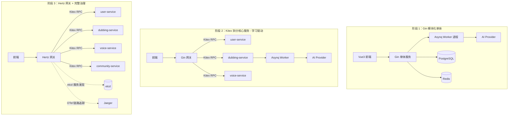
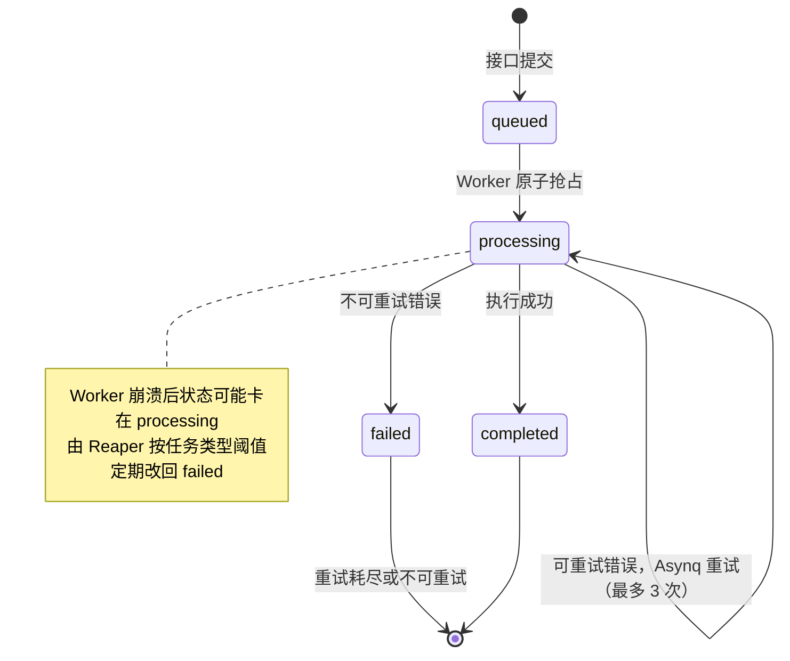
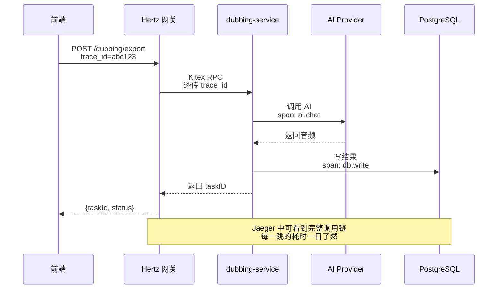
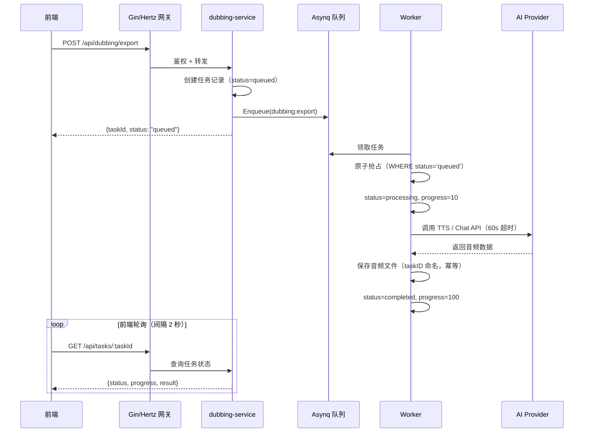
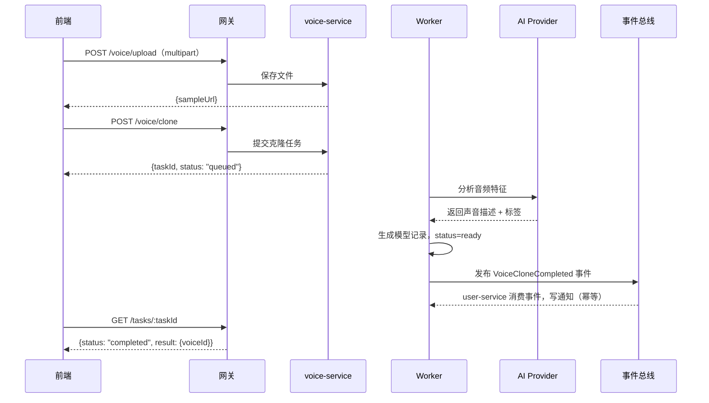

# ParrotSound（鹦音坊）Go 后端技术设计文档

**版本：v1.2 ｜ 目标：从 Gin 模块化单体到 CloudWeGo 微服务的完整演进路线**
**v1.2 相对 v1.1 的修正：①全文搜索从 `tsvector('simple')` 改为 `pg_trgm`（中文有效，零依赖）；②`interactions` 表 `UNIQUE KEY` 改为 PG 标准 `CONSTRAINT ... UNIQUE` 语法；③`notifications.read` 列名改为 `is_read`（避免保留字歧义，JSON 字段名保持 `read` 前端零改动）；④配置统一为 `envconfig + godotenv`，删除选型表里不一致的 Viper；⑤Reaper 改为按任务类型配置不同超时阈值，避免长任务误杀。**

---

## 一、项目定位与设计目标

ParrotSound 是一个全栈 AI 语音平台，核心能力包括智能配音、声音克隆、教育教学课件生成、社区声音分享、用户体系和管理后台。当前 Node.js 版本采用 Express + Redis + MySQL 的单体架构，本文档规划 Go 版本的完整实现方案，并以学习微服务为目标，设计了清晰的三阶段演进路线。

设计上遵循五个原则。**第一，接口零改动**：所有 HTTP API 的路径、请求参数、响应格式与 Node 版完全一致，前端一行代码不用改即可切换。**第二，模块化单体**：代码按业务域组织，每个域内部分层清晰，天然支持未来按域拆分。**第三，异步优先**：所有 AI 调用、音频导出、课件生成一律走异步任务队列，HTTP 接口只负责任务提交和状态查询。**第四，渐进式微服务**：不为拆而拆，按业务痛点逐步拆分，每一步都有明确的技术收益。**第五，诚实标注动机**：阶段 2 的 Kitex 拆分主要目的是学习微服务核心概念，而非解决当前性能瓶颈——生产环境中，单体 + Asynq Worker 分离已足够支撑当前规模。这一点在面试和文档中都要明确说明，避免"为拆而拆"的质疑。

## 二、技术选型总览

| 层次                | 选型                   | 版本建议 | 作用                    |
| ------------------- | ---------------------- | -------- | ----------------------- |
| HTTP 框架（阶段 1） | Gin                    | v1.10+   | 对外 API 网关           |
| HTTP 框架（阶段 3） | Hertz                  | 最新版   | 替换 Gin 作为高性能网关 |
| RPC 框架（阶段 2）  | Kitex                  | 最新版   | 服务间内部通信          |
| ORM                 | GORM                   | v2       | 数据库访问              |
| 数据库（生产）      | PostgreSQL             | 15+      | 主库，JSONB + pgvector  |
| 数据库（开发）      | PostgreSQL（Docker）   | 15+      | 与生产同构，可测全部特性 |
| 数据库（测试）      | SQLite（`:memory:`）   | -        | 单元测试隔离快          |
| 缓存                | go-redis/v9            | v9       | 缓存与计数器，Redis only |
| 异步任务            | Asynq                  | v0.24+   | Redis-backed 任务队列 + 事件总线 |
| 认证                | golang-jwt/v5          | v5       | 无状态 JWT              |
| 限流                | golang.org/x/time/rate | -        | 令牌桶算法 + LRU 清理   |
| 配置                | envconfig + godotenv   | -        | .env 文件加载 + 环境变量启动校验 |
| 日志                | Zap                    | v1.27+   | 结构化日志              |
| 链路追踪（阶段 2）  | OpenTelemetry + Jaeger | -        | 分布式追踪              |
| 服务发现（阶段 2）  | etcd                   | v3.5+    | 服务注册与发现          |
| ID 生成             | UUID                   | -        | 任务 ID（与 Node 版格式一致） |

选型理由可以浓缩成一句话：**每一层选最主流、资料最多、社区最活跃的方案**，降低学习成本，同时保留向字节生态（Hertz + Kitex）平滑演进的能力。

### 2.1 为什么选 PostgreSQL 而不是 MySQL

这是 v1.1 相对 v1.0 最重要的修正。理由有四：

1. **JSON 能力碾压**：本项目 `tags`、`payload`、`result`、`pages` 全是 JSON 密集字段。PG 的 JSONB 支持 GIN 索引和路径查询（`result->>'content' LIKE '%xxx'`、`tags @> '["动漫"]'`），MySQL 的 JSON 索引能力弱很多。
2. **全文搜索更成熟**：`community_voices` 的中文搜索，PG 阶段 1 用 `pg_trgm` 扩展（零分词器依赖，对中文有效），阶段 2 数据量上来后可升级 `zhparser + tsvector` 做精准分词。MySQL 要装 ngram 分词器且效果一般。
3. **未来扩展性**：AI 语音项目天然有"语音相似度检索"需求，pgvector 一行 `CREATE EXTENSION vector` 搞定，MySQL 没有对应能力。
4. **企业级实践**：海外独角兽（Notion、Discord、GitHub、Supabase）大量用 PG，pgvector / PostGIS / TimescaleDB 等扩展生态是 MySQL 没有的。国内大厂用 MySQL 多为运维生态和历史原因。

**GORM 的 dialect 切换接近零成本**：同一份 model 代码支持 PG/MySQL/SQLite，切换只需改 DSN。schema 层面只需三处适配：`JSON` → `datatypes.JSON`，`ENUM` → `VARCHAR + CHECK`，`FULLTEXT` → `pg_trgm` GIN 索引。

### 2.2 为什么砍掉 HybridCache 内存降级层

v1.0 设计了"Redis 优先 + 内存降级"的 HybridCache，v1.1 直接删除。理由：

1. **阶段 2 拆微服务后，每个服务实例有自己的内存缓存，数据不一致问题会被放大**
2. **Redis 挂了，Asynq 也挂了，整个异步链路已经瘫痪，此时缓存降级保住的只是几个列表接口的响应，意义极小**
3. **引入两层缓存反而增加调试复杂度**（"这个数据到底是从哪层拿的？"）

修正方案：**直接用 go-redis，Redis 不可用时返回错误**，由客户端决定降级策略（比如前端展示已缓存的旧数据）。简单粗暴但正确。

## 三、架构演进总览



**阶段 1** 的目标是把所有功能跑通，重点是分层设计和异步任务链路。**阶段 2** 把最重的配音任务和声音克隆拆成独立 Kitex 服务——**主要目的是学习微服务核心概念（IDL/服务发现/RPC/链路追踪），非性能驱动**；生产环境中，单体 + Worker 进程分离已足够支撑当前规模。**阶段 3** 把网关换成 Hertz，补齐服务发现、链路追踪、熔断等治理能力，形成完整的微服务体系。

## 四、阶段 1：Gin 模块化单体（核心阶段）

### 4.1 目录结构

目录按业务域组织，每个域是一个自包含的包，内部严格遵循 handler → service → repository 三层结构。这样设计的直接好处是：未来拆分时，整个域目录可以原封不动地搬进独立服务。

```
parrot-backend-go/
├── cmd/
│   ├── server/main.go              # HTTP 服务入口
│   └── worker/main.go              # Asynq Worker 入口
├── internal/
│   ├── config/config.go            # 配置加载 + 启动校验
│   ├── middleware/
│   │   ├── jwt.go                  # JWT 鉴权
│   │   ├── admin_jwt.go            # 管理员鉴权
│   │   ├── ratelimit.go            # 限流（带 LRU 清理）
│   │   ├── logger.go               # 请求日志
│   │   └── cors.go
│   ├── auth/                       # 认证域
│   │   ├── handler.go
│   │   ├── service.go
│   │   └── repository.go
│   ├── user/                       # 用户域
│   ├── dubbing/                    # 配音域
│   ├── voice/                      # 声音克隆域
│   ├── teaching/                   # 教学域
│   ├── community/                  # 社区域
│   ├── help/                       # 帮助中心域
│   ├── admin/                      # 管理后台域
│   ├── task/                       # 异步任务
│   │   ├── queue.go                # Asynq 客户端封装
│   │   ├── types.go                # 任务类型定义
│   │   ├── handlers.go             # 任务处理器（幂等+超时+错误分流）
│   │   └── reaper.go               # processing 超时清理（按类型阈值）
│   ├── event/                      # 事件总线（复用 Asynq）
│   │   ├── bus.go                  # 事件发布
│   │   ├── types.go                # 事件类型定义
│   │   └── handlers.go             # 事件消费者（幂等）
│   ├── ai/
│   │   ├── client.go               # OpenAI 协议客户端
│   │   └── prompts.go              # Prompt 模板
│   ├── cache/
│   │   └── redis_impl.go           # Redis only，无内存降级
│   ├── storage/
│   │   ├── storage.go              # 存储接口
│   │   └── local_impl.go           # 本地文件存储
│   ├── model/                      # GORM 数据模型
│   └── router/router.go            # 路由注册
├── pkg/
│   ├── response/response.go        # 统一响应格式
│   └── pagination/pagination.go    # 分页工具
├── migrations/001_init.sql
├── .env.example
├── go.mod
├── Dockerfile
├── docker-compose.yml
└── Makefile
```

### 4.2 统一响应格式

保持与 Node 版完全一致的响应结构，这是前端零改动的前提。

```go
// pkg/response/response.go
package response

import "github.com/gin-gonic/gin"

// 分页响应：与 Node 版 {items, total, page, pageSize} 一致
type Paginated struct {
    Items    interface{} `json:"items"`
    Total    int64       `json:"total"`
    Page     int         `json:"page"`
    PageSize int         `json:"pageSize"`
}

func OK(c *gin.Context, data interface{}) {
    c.JSON(200, data)
}

func Paginated(c *gin.Context, items interface{}, total int64, page, pageSize int) {
    c.JSON(200, Paginated{Items: items, Total: total, Page: page, PageSize: pageSize})
}

// 任务创建响应：{taskId, status: "queued"}
func TaskCreated(c *gin.Context, taskID string) {
    c.JSON(200, gin.H{"taskId": taskID, "status": "queued"})
}

// 错误响应：429 限流时返回此格式
func Error(c *gin.Context, code int, msg string) {
    c.JSON(code, gin.H{"code": -1, "message": msg})
}
```

### 4.3 数据模型定义

所有模型与 PostgreSQL 表结构一一对应，GORM tag 负责映射。**v1.2 修正**：`JSON` 字段统一用 `datatypes.JSON`（跨库兼容），`ENUM` 在 PG 端用 `VARCHAR + CHECK` 约束，`notifications` 表的 `read` 列改名为 `is_read`（避免保留字歧义，JSON 字段名保持 `read` 前端零改动），新增 `EventID` 字段支持事件消费者幂等。

```go
// internal/model/user.go
type User struct {
    ID        uint      `gorm:"primaryKey" json:"id"`
    Email     string    `gorm:"uniqueIndex;size:255" json:"email"`
    Password  string    `json:"-"` // 永不序列化到响应
    Nickname  string    `gorm:"size:100" json:"nickname"`
    Avatar    string    `gorm:"size:500" json:"avatar"`
    Role      string    `gorm:"size:20;default:user" json:"role"`     // user | admin
    Status    string    `gorm:"size:20;default:active" json:"status"` // active | disabled
    CreatedAt time.Time `json:"createdAt"`
    UpdatedAt time.Time `json:"updatedAt"`
}

// internal/model/voice.go
type VoiceModel struct {
    ID          uint           `gorm:"primaryKey" json:"id"`
    UserID      uint           `gorm:"index" json:"userId"`
    Name        string         `gorm:"size:200" json:"name"`
    Description string         `gorm:"type:text" json:"description"`
    Tags        datatypes.JSON `gorm:"type:jsonb" json:"tags"` // JSONB
    SampleURL   string         `gorm:"size:500" json:"sampleUrl"`
    Status      string         `gorm:"size:20;default:training" json:"status"` // training | ready | failed
    CreatedAt   time.Time      `json:"createdAt"`
}

// internal/model/dubbing_job.go
type DubbingJob struct {
    ID        uint      `gorm:"primaryKey" json:"id"`
    UserID    uint      `gorm:"index" json:"userId"`
    Title     string    `gorm:"size:500" json:"title"`
    Script    string    `gorm:"type:text" json:"script"`
    Model     string    `gorm:"size:100" json:"model"`
    VoiceID   uint      `json:"voiceId"`
    Status    string    `gorm:"size:20;default:pending" json:"status"` // pending | processing | completed | failed
    AudioURL  string    `gorm:"size:500" json:"audioUrl"`
    CreatedAt time.Time `json:"createdAt"`
}

// internal/model/task.go —— 任务状态机的核心
type Task struct {
    ID         string         `gorm:"primaryKey;size:36" json:"taskId"`
    Type       string         `gorm:"size:50" json:"type"`
    Status     string         `gorm:"size:20;default:queued" json:"status"` // queued | processing | completed | failed
    Progress   int            `gorm:"default:0" json:"progress"`
    Payload    datatypes.JSON `gorm:"type:jsonb" json:"-"`
    Result     datatypes.JSON `gorm:"type:jsonb" json:"result"`
    Error      string         `gorm:"size:1000" json:"error,omitempty"`
    UserID     uint           `gorm:"index" json:"userId"`
    RetryCount int            `gorm:"default:0" json:"-"`
    CreatedAt  time.Time      `json:"createdAt"`
    UpdatedAt  time.Time      `json:"updatedAt"`
}

// internal/model/notification.go
// ★ v1.2 修正：read 列名改为 is_read（避免保留字歧义），JSON 字段名保持 "read" 前端零改动
// ★ v1.1 新增 EventID 字段：事件消费者幂等键
type Notification struct {
    ID        uint      `gorm:"primaryKey" json:"id"`
    UserID    uint      `gorm:"index:idx_user_read" json:"userId"`
    Type      string    `gorm:"size:20;default:system" json:"type"` // system | interaction | task
    Title     string    `gorm:"size:200" json:"title"`
    Content   string    `gorm:"type:text" json:"content"`
    IsRead    bool      `gorm:"column:is_read;index:idx_user_read;default:false" json:"read"` // ★ v1.2: 列名 is_read，JSON 输出 read
    EventID   string    `gorm:"uniqueIndex;size:36" json:"-"` // 事件消费者幂等
    CreatedAt time.Time `json:"createdAt"`
}
```

### 4.4 JWT 认证中间件

```go
// internal/middleware/jwt.go
package middleware

type Claims struct {
    UserID uint   `json:"userId"`
    Email  string `json:"email"`
    Role   string `json:"role"`
    jwt.RegisteredClaims
}

func JWTAuth(secret string) gin.HandlerFunc {
    return func(c *gin.Context) {
        header := c.GetHeader("Authorization")
        token := strings.TrimPrefix(header, "Bearer ")
        if token == "" || token == header {
            response.Error(c, 401, "未登录")
            c.Abort()
            return
        }
        claims := &Claims{}
        _, err := jwt.ParseWithClaims(token, claims, func(t *jwt.Token) (interface{}, error) {
            return []byte(secret), nil
        })
        if err != nil {
            response.Error(c, 401, "token 无效或已过期")
            c.Abort()
            return
        }
        c.Set("userID", claims.UserID)
        c.Set("email", claims.Email)
        c.Set("role", claims.Role)
        c.Next()
    }
}
```

### 4.5 限流中间件（令牌桶 + LRU 清理）

v1.0 的 `map[string]*rate.Limiter` 只增不减，长期运行必然 OOM。v1.1 起加定期清理：

```go
// internal/middleware/ratelimit.go
type limiterEntry struct {
    limiter  *rate.Limiter
    lastSeen time.Time
}

type RateLimiter struct {
    mu       sync.Mutex
    limiters map[string]*limiterEntry
    rate     rate.Limit
    burst    int
}

func NewRateLimiter(r rate.Limit, burst int) *RateLimiter {
    rl := &RateLimiter{
        limiters: make(map[string]*limiterEntry),
        rate:     r,
        burst:    burst,
    }
    // 每 5 分钟清理一次超过 10 分钟没访问的 limiter
    go rl.cleanup(5*time.Minute, 10*time.Minute)
    return rl
}

func (rl *RateLimiter) cleanup(interval, maxAge time.Duration) {
    ticker := time.NewTicker(interval)
    for range ticker.C {
        rl.mu.Lock()
        now := time.Now()
        for key, entry := range rl.limiters {
            if now.Sub(entry.lastSeen) > maxAge {
                delete(rl.limiters, key)
            }
        }
        rl.mu.Unlock()
    }
}

func (rl *RateLimiter) getLimiter(key string) *rate.Limiter {
    rl.mu.Lock()
    defer rl.mu.Unlock()
    if entry, ok := rl.limiters[key]; ok {
        entry.lastSeen = time.Now()
        return entry.limiter
    }
    entry := &limiterEntry{
        limiter:  rate.NewLimiter(rl.rate, rl.burst),
        lastSeen: time.Now(),
    }
    rl.limiters[key] = entry
    return entry.limiter
}

// 限流键：登录用户用 userID，未登录用 IP
func (rl *RateLimiter) Middleware() gin.HandlerFunc {
    return func(c *gin.Context) {
        key := c.ClientIP()
        if uid, ok := c.Get("userID"); ok {
            key = fmt.Sprintf("u:%v", uid)
        }
        if !rl.getLimiter(key).Allow() {
            response.Error(c, 429, "请求过于频繁，请稍后再试")
            c.Abort()
            return
        }
        c.Next()
    }
}
```

### 4.6 缓存层（Redis only）

砍掉 HybridCache 内存降级层，直接用 go-redis。Redis 不可用时返回错误，由客户端决定降级策略。

```go
// internal/cache/redis_impl.go
type Cache struct {
    client *redis.Client
}

func New(client *redis.Client) *Cache {
    return &Cache{client: client}
}

func (c *Cache) Get(ctx context.Context, key string) (string, error) {
    val, err := c.client.Get(ctx, key).Result()
    if errors.Is(err, redis.Nil) {
        return "", ErrNotFound
    }
    if err != nil {
        // 直接返回错误，不做内存降级
        // 由调用方决定是否用旧数据兜底（前端可展示缓存数据）
        return "", err
    }
    return val, nil
}

func (c *Cache) Set(ctx context.Context, key string, value string, ttl time.Duration) error {
    return c.client.Set(ctx, key, value, ttl).Err()
}

func (c *Cache) Incr(ctx context.Context, key string) (int64, error) {
    return c.client.Incr(ctx, key).Result()
}

func (c *Cache) Delete(ctx context.Context, key string) error {
    return c.client.Del(ctx, key).Err()
}
```

### 4.7 AI 客户端（OpenAI-Compatible）

```go
// internal/ai/client.go
type Client struct {
    baseURL string
    apiKey  string
    model   string
    models  []string
    http    *http.Client
}

type ChatRequest struct {
    Model    string    `json:"model"`
    Messages []Message `json:"messages"`
}

type Message struct {
    Role    string `json:"role"`
    Content string `json:"content"`
}

func (c *Client) Chat(ctx context.Context, model string, messages []Message) (string, error) {
    if model == "" {
        model = c.model
    }
    body, _ := json.Marshal(ChatRequest{Model: model, Messages: messages})
    req, err := http.NewRequestWithContext(ctx, "POST",
        c.baseURL+"/chat/completions", bytes.NewReader(body))
    if err != nil {
        return "", err
    }
    req.Header.Set("Content-Type", "application/json")
    req.Header.Set("Authorization", "Bearer "+c.apiKey)

    resp, err := c.http.Do(req)
    if err != nil {
        return "", err
    }
    defer resp.Body.Close()

    var result struct {
        Choices []struct {
            Message Message `json:"message"`
        } `json:"choices"`
    }
    if err := json.NewDecoder(resp.Body).Decode(&result); err != nil {
        return "", err
    }
    if len(result.Choices) == 0 {
        return "", errors.New("AI 返回为空")
    }
    return result.Choices[0].Message.Content, nil
}
```

### 4.8 异步任务队列（Asynq）

这是整个后端最重要的基础设施，配音、克隆、教学三条业务线都依赖它。对 handler 做了四项关键修正：**原子抢占**、**幂等保护**、**超时控制**、**错误分流**。

#### 4.8.1 任务类型与队列

```go
// internal/task/types.go
const (
    TypeAIGeneration  = "ai:generation"
    TypeDubbingExport = "dubbing:export"
    TypeVoiceClone    = "voice:clone"
    TypeTeachingGen   = "teaching:generate"
)

// internal/task/queue.go
type QueueService struct {
    client *asynq.Client
}

// SubmitTask 提交任务：写 PG 记录 + 入队 Asynq，返回 taskId
func (q *QueueService) SubmitTask(ctx context.Context, db *gorm.DB,
    typeName string, userID uint, payload interface{},
    opts ...asynq.Option) (string, error) {

    taskID := uuid.NewString()

    // 1. 先在 PG 落一条任务记录，状态 queued
    record := &model.Task{
        ID: taskID, Type: typeName, Status: "queued",
        UserID: userID,
        Payload: mustJSON(payload),
    }
    if err := db.WithContext(ctx).Create(record).Error; err != nil {
        return "", err
    }

    // 2. 入队 Asynq，用相同 taskID 关联
    //    默认配置：MaxRetry=3，Timeout=120s
    defaultOpts := []asynq.Option{
        asynq.MaxRetry(3),
        asynq.Timeout(120 * time.Second),
        asynq.TaskID(taskID),
        asynq.Retention(72 * time.Hour), // 任务结果保留 72 小时
    }
    data, _ := json.Marshal(payload)
    t := asynq.NewTask(typeName, data, append(defaultOpts, opts...)...)
    if _, err := q.client.EnqueueContext(ctx, t); err != nil {
        // 入队失败：标记 failed，返回错误
        db.Model(record).Update("status", "failed")
        return "", err
    }
    return taskID, nil
}
```

#### 4.8.2 任务处理器（修正版）

```go
// internal/task/handlers.go
//
// 四项关键修正：
//   1. 原子抢占：UPDATE WHERE status='queued'，避免 race condition
//   2. 幂等保护：已 completed 的任务直接跳过
//   3. 超时控制：AI 调用走子 context，避免无限等待
//   4. 错误分流：可重试错误返回 err 让 Asynq 重试；不可重试错误 markFailed + return nil

func NewAIHandler(aiClient *ai.Client, db *gorm.DB, storage Storage) asynq.HandlerFunc {
    return func(ctx context.Context, t *asynq.Task) error {
        taskID := t.ResultWriter().TaskID()

        // === 1. 原子抢占 ===
        // 利用 PG 行锁原子性，两个 Worker 同时执行时只有一个能成功
        // 抢不到说明已被处理或已完成，直接返回（幂等保护）
        result := db.Model(&model.Task{}).
            Where("id = ? AND status = ?", taskID, "queued").
            Updates(map[string]interface{}{
                "status":   "processing",
                "progress": 5,
            })
        if result.RowsAffected == 0 {
            // 已被其他 Worker 抢走，或已 completed/failed
            return nil
        }

        var payload AIGenPayload
        if err := json.Unmarshal(t.Payload(), &payload); err != nil {
            // 不可重试错误：参数错误，终结任务
            markFailed(db, taskID, "payload 解析失败: "+err.Error())
            return nil // ★ return nil，不触发 Asynq 重试
        }

        // === 2. 进度更新（两条路径，注释说明各自用途）===
        // ResultWriter 是 Asynq 内部的中间结果存储（通过 Inspector 查询，重启即失）
        // 数据库 Update 才是前端轮询真正读的进度
        t.ResultWriter().Write(mustJSON(map[string]int{"progress": 20}))
        db.Model(&model.Task{}).Where("id = ?", taskID).Update("progress", 20)

        // === 3. 超时控制 ===
        // 给 AI 调用设 60 秒子超时，避免 Asynq 全局 120s 超时前一直卡着
        aiCtx, cancel := context.WithTimeout(ctx, 60*time.Second)
        defer cancel()

        content, err := aiClient.Chat(aiCtx, payload.Model, payload.Messages)
        if err != nil {
            // === 4. 错误分流 ===
            if errors.Is(err, context.DeadlineExceeded) {
                // 可重试错误：网络抖动、AI 暂时不可用
                // 不改 status（保持 processing），return err 触发 Asynq 重试
                return fmt.Errorf("ai timeout: %w", err)
            }
            // 判断其他可重试错误：5xx、连接重置等
            if isRetryable(err) {
                return fmt.Errorf("retryable: %w", err)
            }
            // 不可重试错误：参数错误、模型不存在等
            markFailed(db, taskID, "AI 调用失败: "+err.Error())
            return nil // 终结任务
        }

        t.ResultWriter().Write(mustJSON(map[string]int{"progress": 90}))

        // === 5. 保存结果（幂等：用 taskID 命名文件，覆盖写）===
        if payload.NeedSaveFile {
            filePath := fmt.Sprintf("tasks/%s/result.wav", taskID)
            if err := storage.Save(aiCtx, filePath, []byte(content)); err != nil {
                // 文件保存失败：可重试
                return fmt.Errorf("save file: %w", err)
            }
        }

        // === 6. 完成 ===
        db.Model(&model.Task{}).Where("id = ?", taskID).Updates(map[string]interface{}{
            "status":   "completed",
            "progress": 100,
            "result":   mustJSON(map[string]string{"content": content}),
        })
        return nil
    }
}

func markFailed(db *gorm.DB, taskID, reason string) {
    db.Model(&model.Task{}).Where("id = ?", taskID).Updates(map[string]interface{}{
        "status": "failed",
        "error":  reason,
    })
}

func isRetryable(err error) bool {
    // 网络错误、5xx、连接重置等判定
    // 简化实现：非 nil 即可重试，生产环境应细判
    return true
}
```

#### 4.8.3 Worker 进程

```go
// cmd/worker/main.go
func main() {
    cfg := config.Load()
    db := initPostgres(cfg)
    aiClient := ai.NewClient(cfg.AIBaseURL, cfg.AIAPIKey, cfg.AIDefaultModel, cfg.AIModels)
    storage := local.New(cfg.UploadDir)

    srv := asynq.NewServer(
        asynq.RedisClientOpt{Addr: cfg.RedisURL},
        asynq.Config{
            Concurrency: cfg.QueueConcurrency,
            Queues: map[string]int{
                "critical": 6, // AI 生成优先级最高
                "default":  3,
                "low":      1,
                "events":   2, // 事件队列，独立优先级
            },
            RetryDelayFunc: asynq.DefaultRetryDelayFunc,
        },
    )

    mux := asynq.NewServeMux()
    mux.HandleFunc(task.TypeAIGeneration,  task.NewAIHandler(aiClient, db, storage))
    mux.HandleFunc(task.TypeDubbingExport, task.NewExportHandler(db, storage))
    mux.HandleFunc(task.TypeVoiceClone,    task.NewVoiceCloneHandler(aiClient, db))
    mux.HandleFunc(task.TypeTeachingGen,   task.NewTeachingHandler(aiClient, db))

    // 注册事件处理器
    mux.HandleFunc(event.EventVoiceCloneCompleted, event.NewVoiceCloneHandler(db))
    mux.HandleFunc(event.EventDubbingExportDone,   event.NewDubbingDoneHandler(db))

    // ★ v1.2: 启动 processing 超时清理器（按任务类型配置不同阈值）
    go task.NewReaper(db, task.ReaperConfig{
        task.TypeAIGeneration:  5 * time.Minute,
        task.TypeDubbingExport: 20 * time.Minute,
        task.TypeVoiceClone:    30 * time.Minute,
        task.TypeTeachingGen:   60 * time.Minute,
    }).Run()

    if err := srv.Run(mux); err != nil {
        log.Fatal(err)
    }
}
```

### 4.9 完整路由表

```go
// internal/router/router.go
func Setup(cfg *config.Config, deps *Dependencies) *gin.Engine {
    r := gin.New()

    // 全局中间件
    r.Use(gzip.Gzip(gzip.DefaultCompression))
    r.Use(middleware.Cors(cfg.FrontendOrigin))
    r.Use(middleware.Logger(deps.Logger, cfg.RequestLogSlowMs))
    r.Use(gin.Recovery())

    // 静态资源（带缓存头）
    r.Static("/uploads", cfg.UploadDir)

    api := r.Group("/api")
    {
        // ===== 认证模块（公开）=====
        auth := api.Group("/auth")
        {
            auth.POST("/register", deps.RL(5, 10), deps.Auth.Register)
            auth.POST("/login", deps.RL(10, 20), deps.Auth.Login)
            auth.POST("/send-code", deps.RL(3, 5), deps.Auth.SendCode)
            auth.POST("/reset-password", deps.RL(3, 5), deps.Auth.ResetPassword)
        }

        // ===== 需要认证的模块 =====
        authorized := api.Group("", middleware.JWTAuth(cfg.JWTSecret))
        {
            // 用户
            user := authorized.Group("/user")
            {
                user.GET("/profile", deps.User.GetProfile)
                user.PUT("/profile", deps.User.UpdateProfile)
                user.GET("/history", deps.User.GetHistory)
                user.GET("/interactions", deps.User.GetInteractions)
                user.GET("/notifications", deps.User.GetNotifications)
                user.PUT("/notifications/:id/read", deps.User.MarkRead)
            }

            // 智能配音
            dubbing := authorized.Group("/dubbing")
            {
                dubbing.POST("/generate-script", deps.RL(5, 10), deps.Dubbing.GenerateScript)
                dubbing.POST("/preview", deps.RL(10, 20), deps.Dubbing.CreatePreview)
                dubbing.POST("/export", deps.RL(5, 10), deps.Dubbing.CreateExport)
                dubbing.GET("/history", deps.Dubbing.GetHistory)
            }

            // 声音克隆
            voice := authorized.Group("/voice")
            {
                voice.POST("/upload", deps.Voice.UploadSample)
                voice.POST("/clone", deps.RL(3, 5), deps.Voice.StartClone)
                voice.GET("/list", deps.Voice.List)
                voice.GET("/:id", deps.Voice.Get)
                voice.POST("/:id/describe", deps.Voice.AIDescribe)
            }

            // 教育教学
            teaching := authorized.Group("/teaching")
            {
                teaching.POST("/projects", deps.Teaching.CreateProject)
                teaching.GET("/projects", deps.Teaching.ListProjects)
                teaching.GET("/projects/:id", deps.Teaching.GetProject)
                teaching.PUT("/projects/:id", deps.Teaching.UpdateProject)
                teaching.POST("/projects/:id/generate-narration",
                    deps.RL(3, 5), deps.Teaching.GenerateNarration)
                teaching.POST("/projects/:id/submit",
                    deps.RL(3, 5), deps.Teaching.SubmitGeneration)
            }

            // 社区
            community := authorized.Group("/community")
            {
                community.GET("/voices", deps.Community.Search)
                community.GET("/voices/:id", deps.Community.Get)
                community.POST("/voices/:id/like", deps.RL(20, 40), deps.Community.Like)
                community.POST("/voices/:id/favorite", deps.RL(20, 40), deps.Community.Favorite)
                community.POST("/voices/:id/reuse", deps.Community.Reuse)
            }

            // 帮助中心
            help := authorized.Group("/help")
            {
                help.GET("/tutorials", deps.Help.ListTutorials)
                help.GET("/tutorials/:id", deps.Help.GetTutorial)
                help.POST("/feedback", deps.RL(5, 10), deps.Help.SubmitFeedback)
            }

            // 任务状态查询（前端轮询入口）
            authorized.GET("/tasks/:taskId", deps.Task.GetStatus)
        }

        // ===== 系统接口（公开）=====
        api.GET("/system/models", deps.System.GetModels)
        api.GET("/health", deps.System.Health)

        // ===== 管理后台 =====
        admin := api.Group("/admin", middleware.AdminAuth(cfg.JWTSecret))
        {
            admin.GET("/stats", deps.Admin.GetStats)
            admin.GET("/users", deps.Admin.ListUsers)
            admin.PUT("/users/:id", deps.Admin.UpdateUser)
            admin.DELETE("/users/:id", deps.Admin.DeleteUser)
            admin.GET("/voices", deps.Admin.ListVoices)
            admin.GET("/jobs", deps.Admin.ListJobs)
            admin.GET("/feedbacks", deps.Admin.ListFeedbacks)
            admin.PUT("/feedbacks/:id", deps.Admin.UpdateFeedback)
            admin.POST("/broadcast", deps.Admin.Broadcast)
        }
    }
    return r
}
```

### 4.10 任务状态机与超时清理

任务状态流转严格遵循状态机，避免状态跳变：



#### 4.10.1 processing 超时清理器（按任务类型阈值）★ v1.2 修正

Worker 进程崩溃（OOM、kill -9、机器宕机）后，任务会卡在 `processing` 状态。原子抢占的 `WHERE status='queued'` 抢不回来，必须由独立清理器兜底。

**v1.2 修正**：v1.1 用固定 10 分钟阈值，会误杀长任务（TTS 长音频、教学课件合成可能需要更久）。v1.2 改为**按任务类型配置不同超时阈值**：

```go
// internal/task/reaper.go
type ReaperConfig map[string]time.Duration // task.type → 超时阈值

type Reaper struct {
    db      *gorm.DB
    config  ReaperConfig
}

func NewReaper(db *gorm.DB, config ReaperConfig) *Reaper {
    return &Reaper{db: db, config: config}
}

// Run 每分钟扫描一次超时的 processing 任务，按类型阈值改回 failed
func (r *Reaper) Run() {
    ticker := time.NewTicker(time.Minute)
    for range ticker.C {
        for taskType, timeout := range r.config {
            cutoff := time.Now().Add(-timeout)
            result := r.db.Model(&model.Task{}).
                Where("type = ? AND status = ? AND updated_at < ?",
                    taskType, "processing", cutoff).
                Updates(map[string]interface{}{
                    "status": "failed",
                    "error":  fmt.Sprintf("worker 超时未响应（阈值 %s）", timeout),
                })
            if result.RowsAffected > 0 {
                log.Printf("[reaper] 清理 %s 类型超时任务 %d 个", taskType, result.RowsAffected)
            }
        }
    }
}
```

**配置示例**（在 Worker 启动时传入）：

```go
// cmd/worker/main.go
go task.NewReaper(db, task.ReaperConfig{
    task.TypeAIGeneration:  5 * time.Minute,   // AI 文本生成，通常很快
    task.TypeDubbingExport: 20 * time.Minute,  // 音频导出，中等耗时
    task.TypeVoiceClone:    30 * time.Minute,  // 声音克隆，较长
    task.TypeTeachingGen:   60 * time.Minute,  // 教学课件合成，最长
}).Run()
```

> **升级路径**：若未来仍有长任务被误杀，可在 handler 内加心跳协程定期刷新 `updated_at`（用 `context.WithCancel` 控制），与类型阈值双重保护。学习项目用类型阈值已足够。

### 4.11 事件总线（复用 Asynq）

阶段 1 单体阶段虽然不需要跨服务通信，但提前引入事件总线有两个好处：
1. 解耦业务逻辑（配音完成 → 发通知 → 更新统计，主流程只管配音，事件驱动其他副作用）
2. 阶段 2 拆服务后，事件总线天然成为跨服务通信方案，业务代码零改动

**复用 Asynq 做事件总线**，不引入 Kafka/NATS，保持简单。事件天然持久化、可重试。

```go
// internal/event/types.go
const (
    EventVoiceCloneCompleted = "event:voice_clone_completed"
    EventDubbingExportDone   = "event:dubbing_export_done"
    EventUserRegistered      = "event:user_registered"
)

type VoiceCloneCompletedEvent struct {
    UserID  uint   `json:"userId"`
    VoiceID uint   `json:"voiceId"`
    Name    string `json:"name"`
}

// internal/event/bus.go
type Bus struct {
    client *asynq.Client
}

// Publish 发布事件：本质是把事件当任务入队 Asynq 的 events 队列
func (b *Bus) Publish(ctx context.Context, eventType string, payload interface{}) error {
    data, _ := json.Marshal(payload)
    t := asynq.NewTask(eventType, data,
        asynq.Queue("events"),
        asynq.MaxRetry(5),       // 事件多重试几次
        asynq.Timeout(30*time.Second),
    )
    _, err := b.client.EnqueueContext(ctx, t)
    return err
}

// internal/event/handlers.go —— 事件消费者（幂等）
//
// 关键：用 EventID（Asynq 的 TaskID）做唯一键，避免重试时重复插入
func NewVoiceCloneHandler(db *gorm.DB) asynq.HandlerFunc {
    return func(ctx context.Context, t *asynq.Task) error {
        var event VoiceCloneCompletedEvent
        if err := json.Unmarshal(t.Payload(), &event); err != nil {
            return nil // payload 错误，不可重试
        }

        notification := &model.Notification{
            UserID:  event.UserID,
            Type:    "task",
            Title:   "声音克隆完成",
            Content: fmt.Sprintf("「%s」已生成，可以使用了", event.Name),
            EventID: t.ID, // ★ Asynq 的 TaskID 天然唯一
        }
        // FirstOrCreate：重试时若已插入则跳过
        return db.Where("event_id = ?", t.ID).FirstOrCreate(notification).Error
    }
}
```

业务侧发布事件示例：

```go
// voice-service 完成克隆任务后发布事件
func (h *VoiceCloneHandler) HandleTask(ctx context.Context, t *asynq.Task) error {
    // ... 克隆逻辑 ...
    db.Model(&model.Task{}).Where("id = ?", taskID).Updates(/* completed */)

    // 发布事件，触发通知
    h.bus.Publish(ctx, event.EventVoiceCloneCompleted,
        event.VoiceCloneCompletedEvent{UserID: userID, VoiceID: voiceID, Name: name})
    return nil
}
```

## 五、阶段 2：Kitex 服务拆分

> **⚠️ 诚实标注**：阶段 2 的拆分主要目的是**学习微服务核心概念**（IDL/服务发现/RPC/链路追踪），而非解决性能瓶颈。生产环境中，单体 + Asynq Worker 进程分离已足够支撑当前规模——Worker 本身就可以独立扩容（多起几个 worker 实例消费同一队列）。拆 Kitex 的真实收益在于"亲手走一遍微服务全流程"，这些经验在面试和实际工作中都有用。文档和面试讲解中都要明确这一点，避免"为拆而拆"的质疑。

当阶段 1 功能稳定后，进入微服务学习阶段。拆分的第一个目标是**配音服务**，理由是它最重、AI 调用最耗时，最适合作为微服务拆分的练手对象。

### 5.1 服务边界与数据归属

拆分的关键原则是**每个服务独占自己的数据表**，跨服务不允许直接查对方的表，必须走 RPC。

| 服务              | 独占的数据表                       | 职责                 |
| ----------------- | ---------------------------------- | -------------------- |
| gateway（Gin）    | 无                                 | 鉴权、限流、协议转换 |
| user-service      | users、notifications               | 用户 CRUD、通知      |
| dubbing-service   | dubbing_jobs、tasks（配音类）      | 配音全流程           |
| voice-service     | voice_models                       | 声音克隆             |
| teaching-service  | teaching_projects、tasks（教学类） | 课件生成             |
| community-service | community_voices、interactions     | 社区                 |

### 5.2 IDL 定义（Thrift）

v1.0 的 IDL 只定义了 2 个方法且 `result` 用 string 传 JSON 是反模式。v1.1 起补全 4 个方法，并用 `union TaskResult` 保持强类型：

```thrift
// idl/dubbing.thrift
namespace go dubbing

struct AudioResult {
    1: string audioURL
    2: i64 durationMs
    3: string format
}

struct ScriptResult {
    1: string content
    2: string title
}

// 用 union 替代 string JSON，保持强类型
union TaskResult {
    1: AudioResult audio
    2: ScriptResult script
}

struct TaskStatusResp {
    1: string taskID
    2: string status
    3: i32 progress
    4: optional TaskResult result
    5: optional string error
}

struct GenerateScriptReq {
    1: i64 userID
    2: string prompt
    3: string model
    4: i32 maxTokens
}

struct PreviewReq {
    1: i64 userID
    2: string script
    3: i64 voiceID
    4: string model
}

struct ExportReq {
    1: i64 userID
    2: string script
    3: i64 voiceID
    4: string model
    5: string format      // wav / mp3
}

struct HistoryReq {
    1: i64 userID
    2: i32 page
    3: i32 pageSize
}

struct HistoryResp {
    1: list<DubbingJob> items
    2: i64 total
    3: i32 page
    4: i32 pageSize
}

service DubbingService {
    TaskStatusResp GenerateScript(1: GenerateScriptReq req)
    TaskStatusResp CreatePreview(1: PreviewReq req)
    TaskStatusResp CreateExport(1: ExportReq req)
    HistoryResp GetHistory(1: HistoryReq req)
}
```

**IDL 强类型的收益边界说明**：Thrift 强类型只在 gateway ↔ dubbing-service 的 RPC 调用之间生效。前端拿到的仍然是 gateway 序列化后的 HTTP JSON 响应，TypeScript 类型定义还是要手写。IDL 解决的是"服务间契约"问题，不解决"前后端契约"问题——后者要么靠 OpenAPI/Swagger 自动生成，要么靠手动维护。

用 Kitex 脚手架生成代码骨架：

```bash
# 生成服务端代码
kitex -module parrot/dubbing-service idl/dubbing.thrift

# 生成网关侧的客户端代码
kitex -module parrot/gateway -client idl/dubbing.thrift
```

### 5.3 服务注册与发现（etcd）

```go
// dubbing-service 服务端注册
r, err := etcd.NewEtcdResolver([]string{cfg.EtcdAddr})
svr := dubbing.NewServer(
    new(DubbingServiceImpl),
    server.WithServiceName("parrot.dubbing"),
    server.WithRegistry(r),
)

// gateway 网关侧调用
cli := dubbing.MustNewClient("parrot.dubbing",
    client.WithResolver(r),
    client.WithRPCTimeout(3*time.Second),
)
resp, err := cli.GenerateScript(ctx, &dubbing.GenerateScriptReq{
    UserID: userID, Prompt: prompt, Model: model,
})
```

### 5.4 网关的职责

拆分后 Gin 网关只做三件事，业务逻辑全部下沉到各服务：

```go
// gateway 内部：HTTP 转 RPC
func (g *Gateway) DubbingGenerateScript(c *gin.Context) {
    userID := c.MustGet("userID").(uint)
    var req GenerateScriptReq
    if err := c.ShouldBindJSON(&req); err != nil {
        response.Error(c, 400, "参数错误")
        return
    }
    resp, err := g.dubbingClient.GenerateScript(c.Request.Context(),
        &dubbing.GenerateScriptReq{
            UserID: int64(userID), Prompt: req.Prompt, Model: req.Model,
        })
    if err != nil {
        response.Error(c, 500, "服务暂时不可用")
        return
    }
    response.TaskCreated(c, resp.TaskID)
}
```

### 5.5 跨服务数据一致性

拆分后最常见的场景：voice-service 克隆完成 → 需要通知 user-service 发 notification。采用"事件总线 + 本地消息表"的最终一致性方案，不引入重型分布式事务框架。

**方案流程**：

1. voice-service 完成业务后，先在本地事务里写业务表 + 事件 outbox 表
2. 后台协程扫描 outbox 表，发布事件到 Asynq
3. user-service 的 Worker 消费事件，幂等写入 notifications 表

```go
// voice-service: 本地消息表 outbox
type EventOutbox struct {
    ID        uint      `gorm:"primaryKey"`
    EventType string    `gorm:"size:50;index"`
    Payload   datatypes.JSON
    Status    string    `gorm:"size:20;default:pending"` // pending | published
    CreatedAt time.Time
}

// 业务事务里同时写业务表和 outbox
func (s *VoiceService) CompleteClone(ctx context.Context, voiceID uint, name string) error {
    return s.db.Transaction(func(tx *gorm.DB) error {
        // 1. 更新 voice_models 状态
        if err := tx.Model(&model.VoiceModel{}).
            Where("id = ?", voiceID).
            Updates(map[string]interface{}{"status": "ready"}).Error; err != nil {
            return err
        }
        // 2. 写 outbox 事件
        payload, _ := json.Marshal(event.VoiceCloneCompletedEvent{
            UserID: userID, VoiceID: voiceID, Name: name,
        })
        return tx.Create(&EventOutbox{
            EventType: event.EventVoiceCloneCompleted,
            Payload:   payload,
        }).Error
    })
}

// 后台协程扫描 outbox，发布到 Asynq
func (s *VoiceService) outboxPublisher() {
    ticker := time.NewTicker(5 * time.Second)
    for range ticker.C {
        var events []EventOutbox
        s.db.Where("status = ?", "pending").Limit(100).Find(&events)
        for _, e := range events {
            t := asynq.NewTask(e.EventType, e.Payload,
                asynq.Queue("events"),
                asynq.TaskID(fmt.Sprintf("outbox-%d", e.ID))) // 幂等键
            if _, err := s.queue.EnqueueContext(ctx, t); err == nil {
                s.db.Model(&e).Update("status", "published")
            }
        }
    }
}
```

这个方案的好处是**不引入新中间件**（复用已有的 Redis + Asynq），事件天然持久化、可重试。等规模真的大了再换 NATS/Kafka，接口层不用改。

## 六、阶段 3：Hertz 网关与完整治理

### 6.1 Hertz 替换 Gin

Hertz 的写法和 Gin 高度相似，迁移成本低。路由注册的差异主要在 API 风格：

```go
// Gin 写法
r.POST("/api/dubbing/preview", handler.Preview)

// Hertz 写法
h := server.Default()
h.POST("/api/dubbing/preview", handler.Preview)
```

Hertz 的优势在底层：基于自研 netpoll 网络库，高并发场景下吞吐更高，且原生支持 HTTP/3。

### 6.2 链路追踪（OpenTelemetry）

微服务最大的痛点是"一个请求跨了 5 个服务，哪里慢了？"，链路追踪就是解决这个问题的。

```go
// 初始化 Tracer
tp := tracesdk.NewTracerProvider(
    tracesdk.WithBatcher(otlptracehttp.NewExporter()),
    tracesdk.WithResource(resource.NewWithAttributes(
        semconv.SchemaURL,
        semconv.ServiceNameKey.String("parrot-gateway"),
    )),
)
otel.SetTracerProvider(tp)

// Kitex 已内置 OTel 支持，只需引入 contrib 包即可自动埋点
```

追踪链路示意：



## 七、核心业务时序

### 7.1 智能配音完整流程



### 7.2 声音克隆流程

声音克隆的特殊点在于需要先上传音频文件，再触发克隆任务。文件上传走同步接口（multipart），克隆本身走异步任务。



## 八、数据库设计（PostgreSQL）

### 8.1 完整 Schema ★ v1.2 修正

v1.2 相对 v1.1 的 schema 调整：
- `community_voices` 全文搜索：删掉 `tsvector('simple')` 生成列（对中文无效），改为 `pg_trgm` + GIN trigram 索引
- `interactions` 表：`UNIQUE KEY` → `CONSTRAINT ... UNIQUE`（PG 标准语法）
- `notifications` 表：`read` 列名改为 `is_read`（避免保留字歧义）

```sql
-- 启用扩展
CREATE EXTENSION IF NOT EXISTS pg_trgm;  -- ★ v1.2: 中文模糊搜索
-- CREATE EXTENSION IF NOT EXISTS vector;  -- 未来语音相似度用

-- 用户表
CREATE TABLE users (
    id BIGSERIAL PRIMARY KEY,
    email VARCHAR(255) NOT NULL UNIQUE,
    password_hash VARCHAR(255) NOT NULL,
    nickname VARCHAR(100) DEFAULT '',
    avatar VARCHAR(500) DEFAULT '',
    role VARCHAR(20) DEFAULT 'user' CHECK (role IN ('user','admin')),
    status VARCHAR(20) DEFAULT 'active' CHECK (status IN ('active','disabled')),
    created_at TIMESTAMPTZ DEFAULT CURRENT_TIMESTAMP,
    updated_at TIMESTAMPTZ DEFAULT CURRENT_TIMESTAMP
);
CREATE INDEX idx_users_email ON users(email);

-- 声音模型表
CREATE TABLE voice_models (
    id BIGSERIAL PRIMARY KEY,
    user_id BIGINT NOT NULL,
    name VARCHAR(200) NOT NULL,
    description TEXT,
    tags JSONB,
    sample_url VARCHAR(500),
    status VARCHAR(20) DEFAULT 'training' CHECK (status IN ('training','ready','failed')),
    created_at TIMESTAMPTZ DEFAULT CURRENT_TIMESTAMP
);
CREATE INDEX idx_voice_models_user ON voice_models(user_id);
-- JSONB 标签查询索引
CREATE INDEX idx_voice_models_tags ON voice_models USING GIN (tags);

-- 配音任务表
CREATE TABLE dubbing_jobs (
    id BIGSERIAL PRIMARY KEY,
    user_id BIGINT NOT NULL,
    title VARCHAR(500),
    script TEXT,
    model VARCHAR(100),
    voice_id BIGINT,
    status VARCHAR(20) DEFAULT 'pending' CHECK (status IN ('pending','processing','completed','failed')),
    audio_url VARCHAR(500),
    created_at TIMESTAMPTZ DEFAULT CURRENT_TIMESTAMP
);
CREATE INDEX idx_dubbing_jobs_user_status ON dubbing_jobs(user_id, status);

-- 教学项目表
CREATE TABLE teaching_projects (
    id BIGSERIAL PRIMARY KEY,
    user_id BIGINT NOT NULL,
    title VARCHAR(500),
    pages JSONB,
    narration TEXT,
    speaker VARCHAR(100),
    voice_id BIGINT,
    status VARCHAR(20) DEFAULT 'draft' CHECK (status IN ('draft','generating','completed','failed')),
    generated_url VARCHAR(500),
    created_at TIMESTAMPTZ DEFAULT CURRENT_TIMESTAMP
);
CREATE INDEX idx_teaching_projects_user ON teaching_projects(user_id);

-- 社区声音表
CREATE TABLE community_voices (
    id BIGSERIAL PRIMARY KEY,
    user_id BIGINT NOT NULL,
    name VARCHAR(200),
    description TEXT,
    tags JSONB,
    audio_url VARCHAR(500),
    likes INT DEFAULT 0,
    favorites INT DEFAULT 0,
    is_public BOOLEAN DEFAULT TRUE,
    created_at TIMESTAMPTZ DEFAULT CURRENT_TIMESTAMP
);
CREATE INDEX idx_community_voices_user ON community_voices(user_id);
CREATE INDEX idx_community_voices_tags ON community_voices USING GIN (tags);

-- ★ v1.2: 中文全文搜索改用 pg_trgm（零分词器依赖，对中文有效）
-- 查询示例：WHERE name ILIKE '%动漫%' OR description ILIKE '%动漫%'
CREATE INDEX idx_community_voices_name_trgm ON community_voices USING GIN (name gin_trgm_ops);
CREATE INDEX idx_community_voices_desc_trgm ON community_voices USING GIN (description gin_trgm_ops);

-- 异步任务表（核心）
CREATE TABLE tasks (
    id VARCHAR(36) PRIMARY KEY,
    type VARCHAR(50) NOT NULL,
    status VARCHAR(20) DEFAULT 'queued' CHECK (status IN ('queued','processing','completed','failed')),
    progress INT DEFAULT 0,
    payload JSONB,
    result JSONB,
    error VARCHAR(1000),
    user_id BIGINT,
    retry_count INT DEFAULT 0,
    created_at TIMESTAMPTZ DEFAULT CURRENT_TIMESTAMP,
    updated_at TIMESTAMPTZ DEFAULT CURRENT_TIMESTAMP
);
CREATE INDEX idx_tasks_user ON tasks(user_id);
CREATE INDEX idx_tasks_status ON tasks(status);
-- Reaper 扫描用联合索引（按类型 + 状态 + 更新时间）
CREATE INDEX idx_tasks_type_status_updated ON tasks(type, status, updated_at);

-- 通知表（★ v1.2: read → is_read；v1.1: 新增 event_id 字段）
CREATE TABLE notifications (
    id BIGSERIAL PRIMARY KEY,
    user_id BIGINT NOT NULL,
    type VARCHAR(20) DEFAULT 'system' CHECK (type IN ('system','interaction','task')),
    title VARCHAR(200),
    content TEXT,
    is_read BOOLEAN DEFAULT FALSE,  -- ★ v1.2: 列名 is_read，避免保留字歧义
    event_id VARCHAR(36),           -- v1.1: 事件消费者幂等键
    created_at TIMESTAMPTZ DEFAULT CURRENT_TIMESTAMP
);
CREATE INDEX idx_notifications_user_read ON notifications(user_id, is_read);
CREATE UNIQUE INDEX idx_notifications_event ON notifications(event_id) WHERE event_id IS NOT NULL;

-- 反馈表
CREATE TABLE feedbacks (
    id BIGSERIAL PRIMARY KEY,
    user_id BIGINT NOT NULL,
    type VARCHAR(20) DEFAULT 'suggestion' CHECK (type IN ('bug','suggestion','other')),
    content TEXT NOT NULL,
    contact VARCHAR(200),
    status VARCHAR(20) DEFAULT 'pending' CHECK (status IN ('pending','processing','resolved')),
    created_at TIMESTAMPTZ DEFAULT CURRENT_TIMESTAMP
);
CREATE INDEX idx_feedbacks_user ON feedbacks(user_id);

-- 互动表（点赞/收藏/复用）
-- ★ v1.2: UNIQUE KEY → CONSTRAINT ... UNIQUE（PG 标准语法）
CREATE TABLE interactions (
    id BIGSERIAL PRIMARY KEY,
    user_id BIGINT NOT NULL,
    target_type VARCHAR(20) NOT NULL CHECK (target_type IN ('voice','community_voice')),
    target_id BIGINT NOT NULL,
    action VARCHAR(20) NOT NULL CHECK (action IN ('like','favorite','reuse')),
    created_at TIMESTAMPTZ DEFAULT CURRENT_TIMESTAMP,
    CONSTRAINT uk_user_target UNIQUE (user_id, target_type, target_id, action)
);

-- 事件 outbox 表（跨服务最终一致性）
CREATE TABLE event_outbox (
    id BIGSERIAL PRIMARY KEY,
    event_type VARCHAR(50) NOT NULL,
    payload JSONB NOT NULL,
    status VARCHAR(20) DEFAULT 'pending' CHECK (status IN ('pending','published')),
    created_at TIMESTAMPTZ DEFAULT CURRENT_TIMESTAMP
);
CREATE INDEX idx_event_outbox_status ON event_outbox(status);

-- ★ v1.2: 向量检索扩展（未来语音相似度用）
-- ALTER TABLE voice_models ADD COLUMN embedding vector(512);
-- CREATE INDEX idx_voice_models_embedding ON voice_models USING ivfflat (embedding vector_cosine_ops);
```

**全文搜索方案升级路径**：

| 阶段 | 方案 | 适用场景 |
|------|------|----------|
| 阶段 1 | `pg_trgm` + `ILIKE '%关键词%'` | 数据量小（<10万行），零额外依赖，对中文有效 |
| 阶段 2+ | `zhparser` + `tsvector` + GIN | 数据量大，需要精准分词和相关性排序 |
| 不推荐 | `to_tsvector('simple', ...)` | 对中文不分词，整段文字当成一个 token，搜索无效 |

### 8.2 索引设计要点

- `tasks.idx_tasks_type_status_updated`：Reaper 按 `WHERE type=? AND status='processing' AND updated_at<?` 扫描的复合索引
- `notifications.idx_notifications_user_read`：覆盖"查询未读通知"最高频场景（注意列名是 `is_read`）
- `notifications.idx_notifications_event`：部分唯一索引（`WHERE event_id IS NOT NULL`），避免普通通知的 NULL 冲突
- `interactions.uk_user_target`：唯一约束同时实现了"防重复点赞"业务逻辑
- `community_voices.idx_*_trgm`：pg_trgm 的 GIN 索引，支持 `ILIKE` 走索引而非全表扫描

## 九、配置与环境变量

环境变量名与 Node 版保持一致，部署脚本可直接复用。**v1.2 修正**：v1.1 选型表写"Viper + envconfig"但代码只用 envconfig，自相矛盾。v1.2 统一为 **`godotenv` 加载 .env 文件 + `envconfig` 做启动校验**，简单直接，阶段 1 不需要 Viper 的配置文件能力。

```go
// internal/config/config.go
package config

import (
    "log"
    "github.com/kelseyhightower/envconfig"
    "github.com/joho/godotenv"
)

type Config struct {
    Port             string   `envconfig:"PORT" default:"3000"`
    FrontendOrigin   string   `envconfig:"FRONTEND_ORIGIN" default:"http://localhost:5173"`
    JWTSecret        string   `envconfig:"JWT_SECRET" required:"true"`
    UploadDir        string   `envconfig:"UPLOAD_DIR" default:"./uploads"`
    RequestLogSlowMs int      `envconfig:"REQUEST_LOG_SLOW_MS" default:"500"`
    CacheTTLSeconds  int      `envconfig:"CACHE_TTL_SECONDS" default:"300"`
    QueueConcurrency int      `envconfig:"QUEUE_CONCURRENCY" default:"10"`
    RedisURL         string   `envconfig:"REDIS_URL" required:"true"`

    // PostgreSQL
    PGHost     string `envconfig:"PG_HOST" required:"true"`
    PGPort     int    `envconfig:"PG_PORT" default:"5432"`
    PGUser     string `envconfig:"PG_USER" required:"true"`
    PGPassword string `envconfig:"PG_PASSWORD" required:"true"`
    PGDatabase string `envconfig:"PG_DATABASE" required:"true"`
    PGSSLMode  string `envconfig:"PG_SSLMODE" default:"disable"`

    // AI
    AIBaseURL      string   `envconfig:"AI_BASE_URL" required:"true"`
    AIAPIKey       string   `envconfig:"AI_API_KEY" required:"true"`
    AIDefaultModel string   `envconfig:"AI_DEFAULT_MODEL" default:"gpt-4o-mini"`
    AIModels       []string `envconfig:"AI_MODELS" default:"gpt-4o-mini,gpt-4.1-mini"`

    // 阶段 2 新增
    EtcdAddr string `envconfig:"ETCD_ADDR"`
    // 阶段 3 新增
    JaegerEndpoint string `envconfig:"JAEGER_ENDPOINT"`
}

func Load() *Config {
    // 1. 加载 .env 文件（不存在则跳过，生产环境用真实环境变量）
    _ = godotenv.Load()

    // 2. 解析 + 校验环境变量
    var cfg Config
    if err := envconfig.Process("", &cfg); err != nil {
        log.Fatalf("配置校验失败: %v", err)
    }
    return &cfg
}
```

**为什么不用 Viper**：阶段 1 只需要环境变量，Viper 的配置文件、热更新、key/value 存储等能力都用不上，引入它反而增加复杂度。等真需要多环境配置文件（dev/staging/prod.yaml）时再引入 Viper，那时校验逻辑仍可保留 envconfig。

`.env.example`：

```env
PORT=3000
FRONTEND_ORIGIN=http://localhost:5173
JWT_SECRET=change-me
UPLOAD_DIR=./uploads
REQUEST_LOG_SLOW_MS=500
CACHE_TTL_SECONDS=300
QUEUE_CONCURRENCY=10
REDIS_URL=redis://localhost:6379

# PostgreSQL
PG_HOST=localhost
PG_PORT=5432
PG_USER=parrot
PG_PASSWORD=Parrot123
PG_DATABASE=parrot
PG_SSLMODE=disable

# AI
AI_BASE_URL=https://api.openai.com/v1
AI_API_KEY=
AI_DEFAULT_MODEL=gpt-4o-mini
AI_MODELS=gpt-4o-mini,gpt-4.1-mini

# 阶段 2
ETCD_ADDR=
# 阶段 3
JAEGER_ENDPOINT=
```

## 十、性能优化对照

| 原 Express 优化       | Go 版本实现                            |
| --------------------- | -------------------------------------- |
| Gzip 压缩             | gin-contrib/gzip 中间件                |
| 请求日志 + 耗时标记   | Zap 结构化日志 + 慢请求阈值告警        |
| Redis 优先 + 内存降级 | Redis only，失败由客户端降级           |
| 高频列表分页          | GORM Limit/Offset + 统一分页响应       |
| 静态资源缓存头        | gin.Static + 自定义 Cache-Control      |
| 无状态 JWT            | golang-jwt，无服务端 session           |
| 异步任务队列          | Asynq，支持优先级/重试/超时/事件总线   |
| 接口限流              | 令牌桶 + LRU 清理，按接口粒度配置      |
| PostgreSQL 连接池     | GORM SetMaxOpenConns / SetMaxIdleConns |
| 多实例计数器          | Redis INCR 原子操作                    |
| JSON 字段查询         | JSONB + GIN 索引                       |
| 中文模糊搜索          | ★ v1.2: pg_trgm + GIN trigram 索引    |

Go 版本额外获得的收益：编译为单二进制文件，Docker 镜像可从 Node 版的 300MB+ 降到 20MB 以内；goroutine 模型天然适配高并发，同等 QPS 下内存占用显著降低。

## 十一、部署方案

### 11.1 多阶段构建 Dockerfile

```dockerfile
# 构建阶段
FROM golang:1.22-alpine AS builder
WORKDIR /app
COPY go.mod go.sum ./
RUN go mod download
COPY . .
RUN CGO_ENABLED=0 go build -ldflags="-s -w" -o server ./cmd/server
RUN CGO_ENABLED=0 go build -ldflags="-s -w" -o worker ./cmd/worker

# 运行阶段（最终镜像约 20MB）
FROM alpine:3.19
RUN apk add --no-cache ca-certificates tzdata
WORKDIR /app
COPY --from=builder /app/server ./server
COPY --from=builder /app/worker ./worker
COPY --from=builder /app/migrations ./migrations
EXPOSE 3000
CMD ["./server"]
```

### 11.2 docker-compose.yml

```yaml
version: "3.8"
services:
  postgres:
    image: postgres:15-alpine
    environment:
      POSTGRES_USER: ${PG_USER}
      POSTGRES_PASSWORD: ${PG_PASSWORD}
      POSTGRES_DB: ${PG_DATABASE}
    ports:
      - "5432:5432"
    volumes:
      - pg_data:/var/lib/postgresql/data
      - ./migrations:/docker-entrypoint-initdb.d

  redis:
    image: redis:7-alpine
    volumes:
      - redis_data:/data

  server:
    build: .
    env_file: .env
    ports:
      - "3000:3000"
    depends_on: [postgres, redis]

  worker:
    build: .
    command: ["./worker"]
    env_file: .env
    depends_on: [postgres, redis]

  # 阶段 2 新增
  etcd:
    image: bitnami/etcd:3.5
    environment:
      ALLOW_NONE_AUTHENTICATION: "yes"

  # 阶段 3 新增
  jaeger:
    image: jaegertracing/all-in-one:latest
    ports:
      - "16686:16686"

volumes:
  pg_data:
  redis_data:
```

## 十二、开发规范

**错误处理**：handler 层统一捕获 service 返回的 error 并转换为 HTTP 响应，service 层只返回错误不直接写响应；所有 error 必须用 `fmt.Errorf("xxx: %w", err)` 包装，保留调用链。

**日志规范**：使用 Zap 的结构化字段，禁止 `log.Printf` 拼接字符串；每条请求日志必须包含 method、path、status、latency、userID 五个字段；超过 `REQUEST_LOG_SLOW_MS` 阈值的请求打 Warn 级别。

**事务边界**：涉及多表写操作必须用 `db.Transaction`；禁止在事务内调用外部服务（AI、HTTP），避免长事务。跨服务一致性用 outbox 模式（见 5.5）。

**幂等性**：
- 点赞、收藏等互动接口通过数据库唯一键实现幂等
- 任务提交接口允许前端重复提交，但 Asynq 用相同 TaskID 天然去重
- 任务处理器用原子 UPDATE 抢占（`WHERE status='queued'`）保证只执行一次
- 事件消费者用 `event_id` 唯一键 + `FirstOrCreate` 防重复消费

**测试**：
- repository 层用 SQLite (`:memory:`) 做单元测试，隔离快
- service 层对 AI 客户端做接口 mock
- 网关层用 httptest 做集成测试，覆盖率目标 70%
- 注意：涉及 PG 特有特性（JSONB 查询、GIN 索引、pg_trgm）的测试必须在 PG 上跑，SQLite 跑不了

## 十三、开发计划

| 阶段 | 内容                                 | 预估时间 | 验收标准               |
| ---- | ------------------------------------ | -------- | ---------------------- |
| 1.1  | 项目骨架 + 配置 + 统一响应 + /health | 1-2 天   | 服务可启动             |
| 1.2  | 用户认证（注册/登录/JWT/验证码）     | 2-3 天   | 登录闭环跑通           |
| 1.3  | 配音模块 + Asynq 任务链路            | 3-4 天   | 提交任务→轮询→拿到结果 |
| 1.4  | 声音克隆 + 教学模块 + 事件总线       | 3-4 天   | 复用任务链路，事件触发通知 |
| 1.5  | 社区 + 帮助 + 管理后台               | 2-3 天   | 全部 CRUD 完成         |
| 1.6  | Reaper + 性能优化 + Docker 部署      | 1-2 天   | 镜像可跑，压测达标     |
| 2.1  | 定义 Thrift IDL + Kitex 脚手架       | 2 天     | 代码生成成功           |
| 2.2  | dubbing-service 独立部署 + etcd 注册 | 3-4 天   | 网关能通过 RPC 调通    |
| 2.3  | 拆 voice-service、user-service       | 4-5 天   | 三个服务独立运行       |
| 2.4  | outbox 跨服务事件通信                | 2-3 天   | 事件链路全通           |
| 3.1  | Hertz 替换 Gin 网关                  | 2-3 天   | 全部接口回归通过       |
| 3.2  | OpenTelemetry + Jaeger 接入          | 2-3 天   | 链路可视化             |
| 3.3  | 熔断限流 + 压测调优                  | 3 天     | 故障注入演练通过       |

阶段 1 完成即是一个可上线的完整后端；阶段 2 完成后你已经真正理解了微服务；阶段 3 完成后这套架构可以写进简历作为亮点项目。

## 十四、简历描述与面试讲解

**简历项目描述建议：**

> 基于 Go 构建的 AI 语音平台后端，采用"模块化单体 → 微服务"演进式架构。初期使用 Gin + GORM + Asynq 实现单体服务，覆盖智能配音、声音克隆、AI 课件生成等核心功能；后期基于 Kitex + etcd 拆分为 6 个微服务，网关迁移至 Hertz，接入 OpenTelemetry 全链路追踪与熔断降级。数据库采用 PostgreSQL（JSONB + GIN 索引 + pg_trgm 中文搜索 + pgvector 向量检索），支持异步任务队列（幂等 + 超时 + 重试 + 事件总线 + 按类型阈值清理）、令牌桶限流，单二进制部署镜像体积控制在 20MB 以内。

**面试高频问题与回答要点：**

*1. 为什么先单体后微服务？*
微服务的复杂度（服务发现、分布式事务、链路追踪）只有在业务规模和团队规模达到一定量级时才有收益，过早拆分会带来不必要的运维成本。先单体可以把精力集中在业务实现上，同时按域分层的代码结构保证了未来拆分的低成本。

*2. 为什么选 Asynq 而不是自己用 goroutine 写队列？*
goroutine 队列无法跨实例共享、进程重启任务丢失、没有重试机制。Asynq 基于 Redis，天然支持多实例部署、任务持久化、失败重试和优先级控制，这些能力自己实现成本很高。同时复用 Asynq 做事件总线，避免引入 Kafka/NATS 等额外中间件。

*3. 拆分后跨服务怎么保证数据一致性？*
优先通过服务边界设计避免分布式事务（每个服务独占自己的表）；确实需要跨服务的场景用"本地消息表（outbox）+ 事件总线 + 幂等消费"的最终一致性方案，而不是引入重型分布式事务框架。

*4. 链路追踪是怎么实现的？*
通过 OpenTelemetry SDK 在每个服务入口生成 trace_id，Kitex 框架自动在 RPC 调用间透传 trace context，所有 span 上报到 Jaeger，可以可视化看到一次请求跨服务的完整调用链和各段耗时。

*5. 为什么从 MySQL 迁移到 PostgreSQL？*
四个理由：①JSON 能力碾压——本项目的 tags/payload/result/pages 全是 JSON 密集字段，PG 的 JSONB 支持 GIN 索引和路径查询，MySQL 的 JSON 索引能力弱很多；②全文搜索更成熟——PG 用 pg_trgm 对中文有效，数据量大了再升级 zhparser + tsvector 做精准分词，MySQL 要装 ngram 分词器且效果一般；③未来扩展性——AI 语音项目有语音相似度检索需求，pgvector 一行扩展搞定，MySQL 没有对应能力；④企业级实践——海外独角兽（Notion、Discord、GitHub）大量用 PG，pgvector/PostGIS 等扩展生态是 MySQL 没有的。

*6. 任务处理器如何保证幂等？*
三层保护：①原子抢占——`UPDATE WHERE status='queued'` 利用数据库行锁，两个 Worker 同时执行时只有一个能成功；②已完成检查——`RowsAffected == 0` 时直接返回，不重复执行；③文件保存幂等——用 taskID 命名文件覆盖写。事件消费者用 `event_id` 唯一键 + `FirstOrCreate` 防重复消费。

*7. Worker 崩溃后卡在 processing 的任务怎么处理？*
独立的 Reaper 协程每分钟扫描一次，**按任务类型配置不同超时阈值**（AI 生成 5 分钟、声音克隆 30 分钟、教学课件 60 分钟），把超时的 processing 任务改回 failed。比固定阈值更合理——避免误杀长任务。若未来仍有误杀，可在 handler 内加心跳协程定期刷新 updated_at，与类型阈值双重保护。

---

## 附录：版本演进与改动清单

### v1.2 相对 v1.1 的改动（5 项）

| # | 改动项 | 章节 | 原因 |
|---|--------|------|------|
| 1 | 全文搜索 `tsvector('simple')` → `pg_trgm` + GIN trigram | 2.1、八 | `simple` 配置对中文不分词，搜索无效；pg_trgm 零依赖且对中文有效 |
| 2 | `interactions` 表 `UNIQUE KEY` → `CONSTRAINT ... UNIQUE` | 八 | `UNIQUE KEY` 是 MySQL 方言，PG 不识别 |
| 3 | `notifications.read` 列名 → `is_read` | 4.3、八 | `read` 在某些 SQL 客户端和 ORM 易混淆；JSON 字段名保持 `read` 前端零改动 |
| 4 | 配置统一为 `envconfig + godotenv`，删 Viper | 二、九 | v1.1 选型表写 Viper 但代码用 envconfig 自相矛盾 |
| 5 | Reaper 固定 10 分钟 → 按任务类型配置不同阈值 | 4.10.1 | 固定阈值会误杀长任务（TTS/课件合成可能 >10 分钟） |

### v1.1 相对 v1.0 的改动（18 项，保留历史）

| # | 改动项 | 章节 | 原因 |
|---|--------|------|------|
| 1 | 数据库 MySQL → PostgreSQL | 二、八、十一 | JSONB/GIN/pgvector 优势，企业级实践 |
| 2 | 砍掉 HybridCache 内存降级层 | 二、4.6 | 拆服务后数据不一致，Redis 挂了任务链路也挂了 |
| 3 | Asynq handler 重写 | 4.8 | 原子抢占+幂等+超时+错误分流 |
| 4 | Worker 配置 MaxRetry/Timeout | 4.8.1 | 避免 AI 调用无限等待 |
| 5 | RateLimiter 加 LRU 清理 | 4.5 | 原 map 只增不减，长期运行 OOM |
| 6 | 新增事件总线 | 4.11 | 跨服务通信基础设施，复用 Asynq |
| 7 | 新增 processing 超时清理器 | 4.10.1 | Worker 崩溃后任务卡死兜底 |
| 8 | 新增 outbox 跨服务一致性 | 5.5 | 拆服务后的最终一致性方案 |
| 9 | Thrift IDL 补全 4 个方法 | 5.2 | v1.0 只有 2 个方法 |
| 10 | Thrift union TaskResult 替代 string JSON | 5.2 | 强类型收益 |
| 11 | notifications 表加 event_id 字段 | 4.3、八 | 事件消费者幂等 |
| 12 | tasks 表加 idx_status_updated 联合索引 | 八 | Reaper 扫描性能 |
| 13 | ENUM → VARCHAR + CHECK | 八 | 迁移更灵活 |
| 14 | FULLTEXT → tsvector + GIN | 八 | PG 原生中文全文搜索（v1.2 进一步改为 pg_trgm） |
| 15 | 配置校验用 envconfig | 九 | 比 Viper 手写 validate 更工程化 |
| 16 | 阶段 2 标注"学习驱动" | 一、三、五 | 诚实标注动机，避免面试质疑 |
| 17 | 开发计划新增 1.4 事件总线 / 2.4 outbox | 十三 | 新增能力的施工排期 |
| 18 | 面试问答新增 3 条 | 十四 | 数据库迁移/幂等/Reaper |
